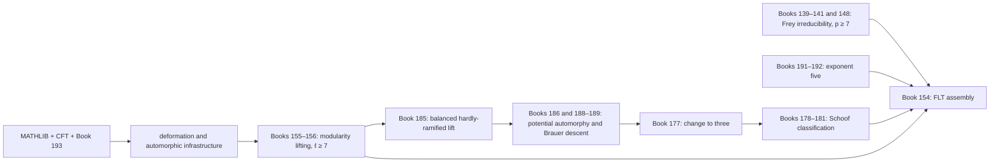

# FLT book dependency graph

This is the dependency companion to `BOOKS.md`. A row `X | A, B` means that A and B supply
substantial direct prerequisites for X. Purely transitive edges, routine Mathlib facts, and small
shared lemmas are omitted; a subject used directly is retained even when another listed
prerequisite also depends on it. Topical order in `BOOKS.md` is not a proposed reading order.

The two external reference nodes are:

- `MATHLIB`: the assumed mathematical background visible in the local checkout.
- `CFT`: the companion Class Field Theory development, including reciprocity, Brauer groups, and invariant maps.

`CFT` is a proof source, not a permitted axiom. The final no-axiom audit must traverse
both external nodes and reject `sorry`, theorem stubs, or additional mathematical axioms in any
transitive import.

## Critical proof spine

## Direct substantial prerequisites

### I. Local and Global Arithmetic

| Book | Direct prerequisites |
|---|---|
| 1 | MATHLIB |
| 2 | 1 |
| 3 | 2 |
| 4 | MATHLIB |
| 5 | 2 |
| 6 | 4, 5 |
| 7 | MATHLIB |

### II. Algebraic-Geometric Foundations and Descent

| Book | Direct prerequisites |
|---|---|
| 8 | MATHLIB |
| 9 | 8, MATHLIB |
| 10 | 1, 8, 13 |
| 11 | 9, 10 |
| 12 | 9, 10, 11, 13, 15 |
| 13 | 8, MATHLIB |
| 14 | 8, 13, MATHLIB |
| 15 | 8, 16, MATHLIB |
| 16 | MATHLIB |
| 17 | 16, 69 |
| 18 | 8, 15, 62 |

### III. Étale, fppf, and Galois Cohomology

| Book | Direct prerequisites |
|---|---|
| 19 | 13, MATHLIB |
| 20 | 21, 22, 23 |
| 21 | 16, 19, MATHLIB |
| 22 | 15, 21 |
| 23 | 21, 22 |
| 24 | 12, 21, 22, 23 |
| 25 | 21, 22, 23 |
| 26 | 8, 37, 23, 25 |
| 27 | 9, 52, 20 |
| 28 | 46, 13, MATHLIB |
| 29 | MATHLIB |
| 30 | 2, 3, 5, 29, 28 |
| 31 | 5, 30 |
| 32 | 6, 29, 30, 31 |
| 33 | 6, 31, 32 |

### IV. Curves, Abelian Varieties, and Mordell–Weil Theory

| Book | Direct prerequisites |
|---|---|
| 34 | 1, 10, 18 |
| 35 | 34, 38 |
| 36 | 9, 12, 13, 15 |
| 37 | 20, 36, 38 |
| 38 | 44, 46, 47, 8, 13, 15 |
| 39 | 10, 12, 36, 38 |
| 40 | 3, 35, 39 |
| 41 | 11, 12, 39, 37 |
| 42 | 28, 38, 30, 32 |
| 43 | 8, 38, 42 |

### V. Elliptic Curves, Finite-Flat Groups, and Integral p-adic Theory

| Book | Direct prerequisites |
|---|---|
| 44 | 13 |
| 45 | 44 |
| 46 | 44, 45, 13 |
| 47 | 45, 46 |
| 48 | 2, 46, 47, 19 |
| 49 | 1, 2, 10 |
| 50 | 2, 49 |
| 51 | 49, 50, 46, 47 |
| 52 | 9, 15, 16, 38 |
| 53 | 16, MATHLIB |
| 54 | 36, 38, 52, 53 |
| 55 | 28, 53, 54 |
| 56 | 2, 44, 45, 46, 47 |
| 57 | 48, 53, 54, 56 |
| 58 | 52, 53, 54, 55, 57 |
| 59 | 48, 55, 58 |
| 60 | 38, 54, 57, 59 |
| 61 | 3, 48, 56, 59 |

### VI. Deformation Theory and Abstract Taylor–Wiles Patching

| Book | Direct prerequisites |
|---|---|
| 62 | MATHLIB |
| 63 | 29, 62 |
| 64 | 29, 62 |
| 65 | 62, 64, 69 |
| 66 | 3, 30, 64, 65 |
| 67 | 31, 48, 30, 64, 65, 59 |
| 68 | 32, 33, 65, 66, 67 |
| 69 | 62 |
| 70 | 69 |
| 71 | 70 |
| 72 | 5, 6, 33, 68, 162 |
| 73 | 68, 72 |
| 74 | 70, 73 |
| 75 | 71, 74 |

### VII. Local Representation Theory and Local Transfer

| Book | Direct prerequisites |
|---|---|
| 76 | MATHLIB |
| 77 | 78, 79, 80, 81 |
| 78 | 76 |
| 79 | 2, 76, 78 |
| 80 | 2, 3, 29, 76 |
| 81 | 5, 78, 79, 80 |
| 82 | 87, 76, 83 |
| 83 | 87, 76, 79 |
| 84 | 80, 83, 85 |
| 85 | 77, 82, 80, 83 |
| 86 | 77, 84, 81 |

### VIII. Quaternionic and Global Automorphic Theory

| Book | Direct prerequisites |
|---|---|
| 87 | 1, 2, 6, CFT |
| 88 | 3, 87 |
| 89 | 4, 88 |
| 90 | 88, 89, 76 |
| 91 | 62, 69, 90 |
| 92 | 4, 77, 99, 102, 106 |
| 93 | 89, 82, 92 |
| 94 | 84, 92, 93, 107, 109, 110, 112 |
| 95 | 6, 81, 98, 107 |
| 96 | 92, 86, 113, 115, 114 |
| 97 | 95, 96 |
| 98 | 4, 5 |
| 99 | MATHLIB |
| 100 | MATHLIB |
| 101 | 99, 100 |
| 102 | 4, 76, 99, 100, 101 |
| 103 | 98, 102 |
| 104 | 78, 98, 102 |
| 105 | 80, 104 |
| 106 | 77, 102, 105 |
| 107 | 91, 92, 93, 27, 52, 106 |
| 108 | 100, 102, 103, 101 |
| 109 | 102, 103, 108 |
| 110 | 108 |
| 111 | 77, 82, 80, 99 |
| 112 | 85, 111, 110 |
| 113 | 92, 86 |
| 114 | 86, 103, 106, 109, 110, 113 |
| 115 | 86, 111, 113 |

### IX. Modular and Shimura Geometry with Galois Realization

| Book | Direct prerequisites |
|---|---|
| 116 | 49, 50, 51, 8, 14 |
| 117 | 8, 10, 14, 116 |
| 118 | 10, 11, 12, 56, 117 |
| 119 | 9, 15, 116, 117 |
| 120 | 116, 117, 118, 119, 121, 123, 124, 126, 127, 130, 131, 128 |
| 121 | 36, 39, 41, 118, 119 |
| 122 | 90, 120, 41, 121, 128 |
| 123 | 87 |
| 124 | 1, 6, 38 |
| 125 | 5, 6, 13, 14, 40, 57, 124 |
| 126 | 4, 123, 124, 125 |
| 127 | 13, 14, 17, 38, 123, 126 |
| 128 | 18, 41, 126, 127 |
| 130 | 15, 18, 22, 38, 40, 60, 127 |
| 131 | 10, 11, 12, 24, 26, 38, 127, 130 |
| 132 | 93, 94, 20, 37, 122, 27, 126, 127, 128 |
| 134 | 19, 20, 27, 123, 132 |
| 135 | 132, 134, 136, 137, 138 |
| 136 | 24, 40, 80, 130, 131, 134 |
| 137 | 26, 107, 134, 136 |
| 138 | 46, 47, 48, 59, 130, 134, 136 |

### X. Eisenstein Descent, Exceptional Torsion, and the Frey Curve

| Book | Direct prerequisites |
|---|---|
| 139 | 116, 117, 118, 119 |
| 140 | 27, 36, 38, 39, 42, 119, 121, 139 |
| 141 | 91, 119, 121, 140, 142, 143, 144, 145, 146, 147, 193 |
| 142 | 91, 119 |
| 143 | 12, 39, 121, 142 |
| 144 | 46, 47, 28, 56, 143 |
| 145 | 62, 38, 39, 60, 72, 142, 143, 144 |
| 146 | 31, 32, 42, 43, 142, 143, 144, 145 |
| 147 | 9, 15, 119, 121, 145, 146 |
| 148 | 139, 140, 141, 153, 149, 150, 151, 152 |
| 149 | 9, 26, 36, 43, 139 |
| 150 | 26, 149 |
| 151 | 42, 150 |
| 152 | 43, 150, 151 |
| 153 | 6, 49, 50, 51, 48, 38, 56, 147, 152 |
| 154 | 49, 50, 51, 180, 148, 185, 188, 189, 191, 192, 193 |

### XI. Integral Automorphic Infrastructure and Modularity Lifting

| Book | Direct prerequisites |
|---|---|
| 155 | 163, 164 |
| 156 | 97, 155, 157, 158, 159, 161, 166, 165 |
| 157 | 77, 56, 58, 59 |
| 158 | 122, 12, 39, 41, 131 |
| 159 | 91, 84, 94, 132, 158 |
| 160 | 73, 88, 89, 90, 91, 158 |
| 161 | 67, 68, 91, 135, 136, 157, 159, 63, 193 |
| 162 | 3, 6, 51, 48, 29 |
| 163 | 68, 71, 91, 122, 135, 17, 157, 161, 162 |
| 164 | 72, 75, 160, 163, 162 |
| 165 | 70, 17, 158, 159, 161, 164 |
| 166 | 97, 155, 157, 158, 159, 161, 165 |

### XII. Arithmetic Approximation and Residual Potential Modularity

| Book | Direct prerequisites |
|---|---|
| 167 | 2, 19, 26 |
| 168 | 8, 13, 18, 167 |
| 169 | 172, 173 |
| 170 | 95, 97, 135, 156, 168, 169, 174 |
| 171 | 2, 6, 167, 168 |
| 172 | 19, 13, 14, 38, 60, 123, 124 |
| 173 | 2, 18, 35, 49, 50, 56, 59, 168, 172 |
| 174 | 95, 135, 168, 171, 166, 172, 173, 162 |

### XIII. Hardly-Ramified Lifts, Compatible Systems, and Changing Prime

| Book | Direct prerequisites |
|---|---|
| 175 | 137, 189, 193 |
| 176 | 188, 187 |
| 177 | 175, 176, 189, 190 |
| 178 | 3, 61 |
| 179 | 7, 178 |
| 180 | 177, 178, 179, 181 |
| 181 | 2, 3, 5, 6, 46, 47, 48, 19, 178, 179, 28, 56, 60, CFT |
| 182 | 3, 48, 30, 66, 67, 56, 59, 157 |
| 183 | 30, 31, 32, 33, 68, 182 |
| 184 | 31, 33, 28, 183, CFT |
| 185 | 62, 69, 170, 166, 182, 183, 184, 162, 63 |
| 186 | 167, 168, 170, 171, 185 |
| 187 | 95, 96, 97, 186 |
| 188 | 29, 62, 187 |
| 189 | 137, 186, 188, 187 |
| 190 | 3, 48, 59, 136, 157, 189 |

### XIV. The Coefficient-Five Boundary

| Book | Direct prerequisites |
|---|---|
| 191 | 1, MATHLIB |
| 192 | 191 |

### XV. Frobenius Density

| Book | Direct prerequisites |
|---|---|
| 193 | 2, 3, 4, 5, 6, 7, 19, 29 |
