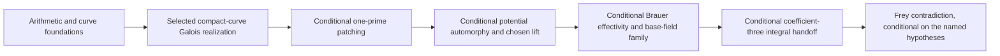

# FLT manuscript dependency graph

A row `X | A, B` means that manuscripts A and B supply substantial results used directly in
manuscript X. Rows are in stable topological order, so every numbered prerequisite is smaller
than its consumer. Purely transitive background is omitted unless the current manuscript
explicitly reuses that source.

`MATHLIB` denotes the assumed mathematical background visible in the local checkout. `CFT`
denotes the companion Class Field Theory development, including reciprocity and Brauer
invariants. Both are proof sources rather than mathematical axioms; unconditional closure also
requires their transitive imports to contain no proof gaps or extra axioms.

The graph records proved source manuscripts only. Named conjectural or unverified hypotheses
are not represented by invented book nodes; they appear after the table.

## Conditional proof spine

## Direct substantial prerequisites

| Book | Manuscript | Direct prerequisites |
|---:|---|---|
| 1 | Valuations, DVRs, and Completions | MATHLIB |
| 2 | Finite Extensions of Local Fields | 1 |
| 3 | Ramification Theory | 2 |
| 4 | Adeles and Ideles | MATHLIB |
| 5 | Local Class Field Theory | 1, 2 |
| 6 | Global Class Field Theory | 4, 5 |
| 7 | Analytic Foundations for Odlyzko--Poitou Bounds | MATHLIB |
| 8 | Ample Line Bundles, Hilbert Polynomials, and Symmetric Powers | MATHLIB |
| 9 | Divisors, Riemann--Roch, and Duality on Relative Curves | 8, MATHLIB |
| 10 | Faithfully Flat Descent in Algebraic Geometry | 8, MATHLIB |
| 11 | Normalization and Regular Models of Arithmetic Curves | 1, 8, 10 |
| 12 | Blowups and Intersection Theory on Arithmetic Surfaces | 9, 11 |
| 13 | Moduli Stacks for Modular and PEL Problems | 8, 10, MATHLIB |
| 14 | Arithmetic Spectral Sequences and Derived Cohomology | MATHLIB |
| 15 | Coherent Cohomology in Proper Families | 8, 14, MATHLIB |
| 16 | Semistable Curves, Dual Graphs, and Component Groups | 9, 11, 12, 10, 15 |
| 17 | Finite Étale Covers and Fundamental Groups | 10, MATHLIB |
| 18 | Derived Étale and $\ell$-adic Cohomology | 14, 17, MATHLIB |
| 19 | Proper and Smooth Base Change | 15, 18 |
| 20 | Étale Duality and Trace Maps for Curves | 18, 19 |
| 21 | Étale Sheaves and Cohomology on Curves | 16, 17, 18, 19, 20 |
| 22 | Nearby Cycles and Monodromy for Semistable Curves | 16, 18, 19, 20 |
| 23 | Lefschetz Trace Formulas for Curves | 18, 19, 20 |
| 24 | Continuous Cohomology of Profinite Groups | MATHLIB |
| 25 | Relative Picard Schemes and Jacobians | 9, 16, 10, 15 |
| 26 | Finite Locally Free Schemes and Algebras | 8, 10 |
| 27 | Affine Group Schemes and Hopf Algebras | 26 |
| 28 | Finite Flat Commutative Group Schemes | 26, 27, 10 |
| 29 | fppf Cohomology and Kummer Theory | 28, 10, MATHLIB |
| 30 | Local Galois Cohomology | 2, 3, 5, 24, 29 |
| 31 | Tate Local Duality | 5, 30 |
| 32 | Global Galois Cohomology and Selmer Groups | 6, 24, 30, 31 |
| 33 | Poitou–Tate Duality | 6, 31, 32 |
| 34 | Cartier Duality | 27, 28 |
| 35 | Abelian Schemes, Isogenies, and Polarizations | 26, 28, 34, 8, 10, 15 |
| 36 | Jacobians and $H^1$ of Curves | 21, 25, 35 |
| 37 | Weights and Weil Bounds for Curves and Abelian Varieties | 8, 20, 21, 23, 36 |
| 38 | Néron Models and Component Groups | 11, 16, 25, 35 |
| 39 | Integral Correspondences on Curves and Jacobians | 12, 16, 38, 36 |
| 40 | Descent and Weak Mordell--Weil for Abelian Varieties | 29, 35, 30, 32 |
| 41 | Heights and the Mordell--Weil Theorem | 8, 35, 40 |
| 42 | Finite-Flat Galois Representations | 2, 28, 34, 17 |
| 43 | Elliptic Curves over DVRs | 1, 2, 11 |
| 44 | Tate Curves and Multiplicative Reduction | 2, 43 |
| 45 | Torsion and Tate Modules of Elliptic Curves | 43, 44, 28, 34 |
| 46 | Algebraic de Rham Cohomology and Gauss--Manin Connections | 9, 15, 14, 35 |
| 47 | Betti, de Rham, and Étale Comparison for Curves | 9, 46, 21 |
| 48 | Divided Powers and Crystalline Sites | 14, MATHLIB |
| 49 | Crystalline Cohomology of Curves and Abelian Schemes | 25, 35, 46, 48 |
| 50 | Syntomic Cohomology and Integral Period Maps | 29, 34, 35, 48, 49 |
| 51 | Finite-Flat Group Schemes of Small Height | 2, 26, 27, 28, 34 |
| 52 | Dieudonné Theory and Raynaud Full Faithfulness | 42, 48, 49, 51 |
| 53 | Fontaine--Laffaille Modules and Torsion Representations | 46, 48, 49, 50, 52 |
| 54 | Integral Fontaine--Laffaille Equivalence and Base Change | 34, 42, 50, 52, 53 |
| 55 | $p$-divisible Groups and Serre--Tate Theory | 35, 49, 52, 54 |
| 56 | Ramification and Discriminants of Finite-Flat Representations | 3, 42, 51, 54 |
| 57 | Artinian and Complete Local Coefficient Rings | MATHLIB |
| 58 | Formal Schemes, GAGA, and Algebraization | 8, 15, 57 |
| 59 | Rigid Analytic Curves and Formal Models | 1, 11, 58 |
| 60 | Rigid Uniformization of Abelian Varieties | 59, 35 |
| 61 | Semistable Abelian Varieties and Monodromy | 3, 60, 38 |
| 62 | Pseudocompact Trace Algebras and Carayol Descent | 24, 57 |
| 63 | Deformation Functors of Representations | 24, 57 |
| 64 | Complete Local Algebra for Deformation Theory | 57 |
| 65 | Cotangent Complexes, Perfect Complexes, and Determinant Lines | 14, 64 |
| 66 | Representability of Deformation Problems | 24, 57, 63, 64 |
| 67 | Local Deformation Conditions Away from $\ell$ | 3, 30, 63, 66 |
| 68 | Finite Flat Deformation Conditions at $\ell$ | 31, 42, 30, 63, 66, 54 |
| 69 | Global Deformation Problems | 32, 33, 66, 67, 68 |
| 70 | Depth, Complete Intersections, and Fitting Ideals | 64 |
| 71 | Numerical Criteria for $R=T$ | 64, 70 |
| 72 | Smooth Representations of $p$-adic Groups | MATHLIB |
| 73 | Parabolic Induction, Jacquet Modules, and Whittaker Models for $\mathrm{GL}_2$ | 72 |
| 74 | Dihedral Supercuspidals, Types, and Newvectors for $\mathrm{GL}_2$ | 2, 72, 73 |
| 75 | Weil--Deligne Representations and Local Constants | 2, 3, 24, 72 |
| 76 | Local Langlands in the Principal, Special, and Dihedral Cases | 5, 73, 74, 75 |
| 77 | Quaternion Algebras over Number Fields | 1, 2, 6, CFT |
| 78 | Characters and Dihedral Types on Quaternion Division Algebras | 77, 72, 74 |
| 79 | Representations of Quaternion Division Algebras | 72, 74, 77, 78 |
| 80 | Local Jacquet--Langlands for Special and Dihedral Packets | 73, 74, 75, 76, 79, 78 |
| 81 | Cyclic Base Change: Local Theory | 3, 5, 73, 74, 76, 80 |
| 82 | Orders in Quaternion Algebras | 3, 77 |
| 83 | Automorphic Forms on Definite Quaternion Algebras | 4, 82 |
| 84 | Hecke Operators on Quaternionic Forms | 72, 77, 82, 83 |
| 85 | Hecke Algebras and Congruences | 57, 64, 84 |
| 86 | Schwartz–Bruhat Analysis and Tate’s Thesis | 4, 5 |
| 87 | Archimedean GL₂ and Discrete Series | MATHLIB |
| 88 | Hilbert-Space Spectral and Trace-Class Theory | MATHLIB |
| 89 | Sobolev Theory and Elliptic Regularity on Arithmetic Quotients | 87, 88 |
| 90 | Reduction Theory and the Cuspidal Spectrum of $\mathrm{GL}_2$ | 4, 72, 87, 88, 89 |
| 91 | Global Constant Terms and Eisenstein Contributions for $\mathrm{GL}_2$ | 86, 90 |
| 92 | Global Whittaker Models and Rankin–Selberg Theory | 73, 86, 90 |
| 93 | Analytic Theory of Automorphic Rankin–Selberg L-functions | 75, 92 |
| 94 | Strong Multiplicity One and Global Newforms for $\mathrm{GL}_2$ | 73, 76, 90, 92, 93 |
| 95 | Automorphic Representations of $\mathrm{GL}_2$ | 4, 73, 87, 90, 92, 94 |
| 96 | Automorphic Representations of $D^\times$ | 4, 77, 79, 83, 86, 88, 89, 90, 91, 92, 94, 95 |
| 97 | Algebraicity and Integral Structures of Weight-Two Packets | 85, 95, 96, 47, 46, 94 |
| 98 | Hecke Characters and Automorphic Induction from $\mathrm{GL}_1$ | 6, 76, 86, 97 |
| 99 | Cuspidal Trace-Formula Kernels for Rank Two | 88, 90, 91, 89 |
| 100 | The Cuspidal Spectral Side of the $\mathrm{GL}_2$ Trace Formula | 90, 91, 99 |
| 101 | The Geometric Side of the GL₂ Trace Formula | 99 |
| 102 | Orbital Integrals for $\mathrm{GL}_2$ and Quaternion Algebras | 73, 74, 75, 79, 80, 87 |
| 103 | Transfer of Test Functions and the Rank-Two Fundamental Lemma | 80, 102, 101 |
| 104 | Global Jacquet--Langlands | 80, 95, 96, 97, 100, 101, 103 |
| 105 | Twisted Conjugacy and Geometric Trace Distributions | 95, 81 |
| 106 | Twisted Cuspidal Trace Kernels and Spectral Expansion | 81, 91, 94, 100, 101, 105 |
| 107 | Twisted Orbital Matching and the Cyclic Fundamental Lemma | 81, 102, 105 |
| 108 | Cyclic Base Change for $\mathrm{GL}_2$ | 80, 81, 95, 96, 102, 103, 105, 106, 107 |
| 109 | Solvable Base Change and Descent | 6, 24, 81, 77, 95, 104, 98, 108 |
| 110 | Generalized Elliptic Curves and Level Structures | 43, 44, 45, 8, 13 |
| 111 | Compactified Modular Stacks and Coarse Modular Curves | 8, 11, 13, 110 |
| 112 | Deligne--Rapoport Integral Models of Modular Curves | 11, 12, 16, 51, 110, 111 |
| 113 | Integral Modular Forms and q-Expansion | 9, 15, 110, 111 |
| 114 | Modular Jacobians, Néron Models, and Hecke Correspondences | 25, 38, 39, 112, 113 |
| 115 | Reductive Groups, Inner Forms, and Corestriction in Rank Two | 77 |
| 116 | CM Abelian Varieties, Types, and Reflex Norms | 1, 6, 35 |
| 117 | Complex Multiplication, Reciprocity, and Reduction | 5, 6, 10, 13, 61, 52, 116 |
| 118 | Shimura Data and Canonical Models in the FLT Cases | 4, 115, 116, 117 |
| 119 | Quaternionic PEL Functors and Representability | 10, 13, 65, 35, 115, 118 |
| 120 | Uniformization, Components, and Hecke Descent for Shimura Curves | 58, 39, 118, 119 |
| 121 | Good Integral Models of Quaternionic Shimura Curves | 15, 58, 19, 35, 61, 55, 119 |
| 122 | Semistable Models and Monodromy of Quaternionic Shimura Curves | 11, 12, 16, 22, 35, 37, 76, 119, 121 |
| 123 | Modular and Shimura Curves | 110, 111, 112, 114, 115, 116, 118, 119, 121, 122, 120 |
| 124 | Hecke Correspondences on Curves and Jacobians | 39, 83, 84, 114, 120, 123 |
| 125 | Automorphic Decomposition of Shimura-Curve $H^1$ | 21, 47, 36, 96, 104, 87, 124, 118, 119, 120 |
| 126 | Galois Representations from Weight-Two Shimura-Curve Cohomology | 17, 21, 47, 115, 125 |
| 127 | Galois Representations Attached to Weight-Two Automorphic Forms | 104, 125, 126 |
| 128 | Local--Global Compatibility for Weight-Two Galois Representations | 22, 61, 75, 76, 104, 121, 122, 125, 126 |
| 129 | Galois Lattices and Finite-Flat Closures in Abelian Tate Modules | 35, 26, 27, 28, 34, 42, 45, 52, 53, 54, 125, 126 |
| 130 | Modular Curves $X_0(N)$ and $X_1(N)$ | 110, 111, 112, 113 |
| 131 | Jacobians of Modular Curves | 47, 25, 35, 38, 40, 113, 114, 130 |
| 132 | Eisenstein Series, Congruences, and the Eisenstein Ideal | 85, 113 |
| 133 | Cuspidal Divisors and Specialization on Modular Jacobians | 16, 38, 114, 132 |
| 134 | Mazur–Raynaud Admissible Group Schemes | 28, 34, 29, 51, 133 |
| 135 | Genus-Two Curves, Jacobians, and Abel--Jacobi Geometry | 9, 37, 25, 41, 130 |
| 136 | Mumford Representations and Exact Genus-Two Jacobian Arithmetic | 37, 135 |
| 137 | Explicit Two-Descent on Genus-Two Jacobians | 40, 136 |
| 138 | Integral Local Types and Type Lattices | 51, 53, 54, 73, 74, 75, 76 |
| 139 | Ihara Theory and Saturated Degeneracy Maps on Shimura Curves | 16, 38, 39, 124, 118, 122 |
| 140 | Integral Level Change and Jacquet--Langlands Comparison | 80, 85, 104, 125, 139 |
| 141 | Dickson Classification and Adequate Residual Image | 3, 6, 45, 42, 24 |
| 142 | Taylor–Wiles Primes | 5, 6, 33, 69, 141 |
| 143 | Taylor–Wiles Systems | 69, 142 |
| 144 | Patching Modules and Rings | 69, 70, 143 |
| 145 | The Abstract $R=T$ Argument | 71, 144 |
| 146 | Completed Hecke Pieces and Eisenstein $p$-divisible Groups | 28, 34, 35, 38, 51, 55, 57, 85, 114, 132, 133, 134, 142 |
| 147 | Eisenstein Descent and the Mordell--Weil Group of the Eisenstein Quotient | 31, 32, 40, 41, 132, 133, 134, 146 |
| 148 | Eisenstein Cotangent Lattices and Formal Immersion | 9, 15, 113, 114, 146, 147 |
| 149 | Mordell--Weil Sieves for Hyperelliptic Curves | 41, 148, 136, 137 |
| 150 | Semistable Full-Two Residual Irreducibility | 6, 35, 42, 44, 45, 51, 148, 149 |
| 151 | Deep-Level Quaternionic Modules and Diamond Actions | 143, 82, 83, 84, 85, 139 |
| 152 | Hilbert Irreducibility and Arithmetic Approximation | 2, 17, 37 |
| 153 | Moret–Bailly’s Theorem | 8, 10, 58, 152 |
| 154 | Galois and Solvable Refinements of Arithmetic Approximation | 2, 6, 152, 153 |
| 155 | Hilbert--Blumenthal Moduli and Two-Prime Level Covers | 17, 10, 13, 35, 55, 115, 116 |
| 156 | Local Geometry of Hilbert--Blumenthal Moduli | 2, 58, 60, 43, 44, 51, 54, 153, 155 |
| 157 | Moduli Constructions for Potential Modularity | 155, 156 |
| 158 | Discriminants of Galois Representations | 3, 56 |
| 159 | Odlyzko Bounds and Fontaine's Argument | 7, 158 |
| 160 | Schoof's Finite-Flat Category over $\mathbf Z[1/2]$ | 2, 3, 17, 29, 28, 34, 42, 51, 55, 158, 159 |
| 161 | Quintic Cyclotomic Units and Kummer Arithmetic | 1, MATHLIB |
| 162 | Cyclotomic Descent for Quintic Fermat-Type Equations | 161 |
| 163 | The Frey Curve: Arithmetic Reduction and the Exact Modular-Method Handoff | 43, 44, 45, 150, 162 |
| 164 | Local Conditions for Hardly-Ramified Minimal Deformations | 30, 31, 44, 63, 66, 67, 68, 163 |
| 165 | Supported Galois Cohomology and Selmer Calculations | 24, 30, 31, 32, 33, 69, 164 |
| 166 | Relation Obstructions and Poitou--Tate Corrections | 164, 165 |
| 167 | The Chebotarev Density Theorem | 2, 3, 4, 5, 6, 7, 17, 21, 23, 24 |
| 168 | Compatible Coefficient Systems and Purity | 37, 104, 97, 122, 125, 126, 128, 167 |
| 169 | The Eisenstein Ideal | 85, 113, 114, 131, 132, 133, 134, 146, 147, 148, 167 |
| 170 | Hecke-Valued Galois Representations and Nonminimal Reciprocity | 68, 69, 85, 127, 128, 138, 140, 62, 167 |
| 171 | The Minimal Totally-Real Deformation--Hecke Problem | 69, 71, 85, 124, 127, 65, 138, 170, 141 |
| 172 | Minimal Patching and $R=T$ over Totally Real Fields | 141, 142, 143, 144, 145, 151, 171 |
| 173 | Minimal Modularity Lifting | 171, 172 |
| 174 | One-Prime Type Complexes and Component Support | 6, 65, 67, 70, 122, 138, 139, 140, 151, 170, 141, 171, 172 |
| 175 | One-Prime Nonminimal Patching and R=T | 109, 173, 138, 139, 140, 170, 174 |
| 176 | Nonminimal Modularity Lifting | 109, 173, 138, 139, 140, 170, 175, 174 |
| 177 | Potential Modularity of Two-Dimensional Representations | 104, 98, 127, 176, 153, 157, 167 |
| 178 | Auxiliary Dihedral Data and Residual Potential Modularity | 104, 98, 127, 141, 175, 153, 154, 155, 156 |
| 179 | Compatible Systems of Galois Representations | 168, 141, 167 |
| 180 | Brauer Induction and Descent of Automorphy | 24, 75, 98, 109, 168 |
| 181 | Finite Image and the Balanced Minimal-Lift Argument | 57, 62, 64, 141, 163, 164, 165, 166, 173 |
| 182 | Potential Automorphy and Galois Refinement of a Chosen Lift | 109, 127, 128, 168, 163, 173, 154, 178, 164, 181 |
| 183 | Brauer Induction for Automorphy Families | 98, 108, 109, 154, 180, 182 |
| 184 | Brauer Characters and Effectivity of Compatible Families | 24, 57, 180, 183 |
| 185 | Compatible Systems over the Base Field | 168, 180, 182, 183, 184 |
| 186 | Changing the Coefficient Prime while Keeping the Frey Special Place | 185 |
| 187 | The Fixed-Three Integral Local Theory | 3, 42, 54, 129, 185 |
| 188 | Hardly Ramified $3$-adic Representations | 2, 3, 5, 6, 17, 28, 29, 34, 42, 51, 158, 159, 185, 187, CFT |

## Named unresolved theorem hypotheses

These conditions are assumptions or missing source theorems, not dependency nodes. The list is
deliberately separate from the acyclic manuscript graph.

- **Localized abelian Ihara:** vanishing of the localized noncongruence-character quotient
  required for saturated two-map Ihara; the current Ihara manuscript isolates but does not prove it.
- **Type and node comparison:** the named type-coefficient extension, type-Ihara,
  primitive-residue, node-uniformization, generic-support, and one-prime component-support
  hypotheses used by the integral level-change and type-complex manuscripts.
- **Exact acting orders and augmentation:** reduced-source support, faithful Hecke-order
  equality, primary/companion augmentation, and global reducedness in the one-prime
  nonminimal comparison.
- **Several active places:** mixed Ihara exactness, product-residue comparison, simultaneous
  component support, and joint faithful-order augmentation for the actual finite active set.
- **Controlled residual automorphic seed:** the post-specialization clean seed, normal-closure
  control, and bridge-readiness record required by the chosen-lift and controlled-top datum.
- **Balanced-lift finiteness:** the exact automorphic seed and restricted reduced-finiteness
  hypothesis used to obtain a horizontal characteristic-zero point of the hardly-ramified ring.
- **Uniform local preservation:** raw-to-global preservation of the signed special
  Weil--Deligne pair at every coefficient embedding used in the Brauer packet array.
- **Coefficient-three integral source:** crystallinity of the selected three-adic member with
  Hodge type $\{0,1\}$, or an equivalent proved good geometric/strongly-divisible carrier,
  together with a named global lattice whose dyadic monodromy thickness is primitive when needed.

Consequently the final conditional-FLT spine is **not unconditionally closed**. No review or
catalog status may be read as claiming otherwise.
