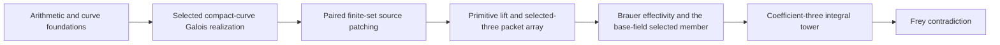

# FLT manuscript dependency graph

A row `X | A, B` means that manuscripts A and B supply substantial results used directly in
manuscript X. Rows are in stable topological order, so every numbered prerequisite is smaller
than its consumer. Purely transitive background is omitted unless the current manuscript
explicitly reuses that source.

`MATHLIB` denotes the mathematical background visible in the local checkout. It is a proof
source rather than a mathematical axiom. The dependency statement below concerns the manuscript
graph; the integrity of that external proof source is a separate foundational check. The
`CFT` token formerly denoted the companion Class Field Theory development; its one consumer,
Book 77, now cites the in-collection Books 5 and 6 instead, and no row uses the token.

The graph records proved source manuscripts only. Stronger results not established in the
collection are not represented by invented book nodes; their relationship to the preferred
theorem is explained after the table.

An edge records where a manuscript result is routed; it does not erase an unresolved hypothesis
that the source manuscript itself labels. The conditional interfaces formerly labeled in Books 3,
5--6, 8, 9, 11, and 12 (local-Dold congruence and integral Brauer induction; Tate-cohomology,
norm-filtration, finite Artin--Verdier duality, canonical-$S$-unit, and rank-one
Tate--Sen/Lubin--Tate inputs; projective flattening and bounded Macaulay--Gotzmann; curve duality
and perfect pushforward; surface resolution and contraction) have all since been discharged by
in-manuscript proofs and are no longer conditional.

The known background that remains undischarged in Books 8--12 — assumed in proofs but proved in
no earlier book and absent from the local Mathlib checkout — has largely been discharged: Books
8 and 9 now cite their sheaf-cohomology formalism from Books 7a and 7b, Book 8's former
out-of-order use of Cartier-divisor descent is replaced by an inline finite-locally-free descent
section, Book 9 constructs its residue pairing and proves Stein factorization (discharging Book
12's connected-fiber background), factoriality of regular local rings is proved as Book 11's
Auslander--Buchsbaum theorem (with the dimension-at-most-two case Book 9 needs proved earlier,
in Book 9 itself), Book 11's Cohen-theory citations are routed to Book 1, Chapter 13, and Book
8 now proves descent of morphisms into quasi-projective targets, discharging the sheaf property
of Hom its universal-divisor construction formerly assumed. Book 10a proves the excellence
permanence theory (under one explicit standing hypothesis, residue fields of finite $p$-degree,
satisfied by every base the collection uses), and Book 11's formerly explicit
universally-excellent hypothesis is discharged against it. The last flagged interface — the
étale-local nodal normal form, which Book 9 proves only after completion and which Book 21's
semistable chapter consumes — is now proved as Book 21's Theorem 19.2 for the regular
(thickness-one) families in which it is used, by an elementary standard-étale-algebra argument
requiring no approximation theory. The stronger statement for an arbitrary flat family with
arbitrary smoothing parameter remains unproved and is used nowhere; Book 9's remark marks it
explicitly. No interface is silently assigned to `MATHLIB`.

## Preferred selected-three proof spine

## Direct substantial prerequisites

| Book | Manuscript                                                                     | Direct prerequisites                                                                                                                                              |
| ---: | ------------------------------------------------------------------------------ | ----------------------------------------------------------------------------------------------------------------------------------------------------------------- |
|    1 | Valuations, DVRs, and Completions                                              | MATHLIB                                                                                                                                                           |
|    2 | Finite Extensions of Local Fields                                              | 1                                                                                                                                                                 |
|    3 | Ramification Theory                                                            | 2                                                                                                                                                                 |
|    4 | Adeles and Ideles                                                              | 1, 2, 3, MATHLIB                                                                                                                                                  |
|    5 | Local Class Field Theory                                                       | 1, 2                                                                                                                                                              |
|    6 | Global Class Field Theory                                                      | 3, 4, 5                                                                                                                                                           |
|    7 | Analytic Foundations for Odlyzko--Poitou Bounds                                | 3, MATHLIB                                                                                                                                                        |
|   7a | Arithmetic Spectral Sequences and Derived Cohomology                           | MATHLIB                                                                                                                                                           |
|   7b | Quasi-coherent Cohomology on Schemes                                           | 7a, MATHLIB                                                                                                                                                       |
|    8 | Ample Line Bundles, Hilbert Polynomials, and Symmetric Powers                  | 7a, 7b, MATHLIB                                                                                                                                                   |
|    9 | Divisors, Riemann--Roch, and Duality on Relative Curves                        | 1, 7a, 7b, 8, MATHLIB                                                                                                                                             |
|   10 | Faithfully Flat Descent in Algebraic Geometry                                  | 8, MATHLIB                                                                                                                                                        |
|  10a | Excellent Rings and Formal Fibers                                              | 1, MATHLIB                                                                                                                                                        |
|   11 | Normalization and Regular Models of Arithmetic Curves                          | 1, 8, 9, 10, 10a                                                                                                                                                  |
|   12 | Blowups and Intersection Theory on Arithmetic Surfaces                         | 9, 11                                                                                                                                                             |
|   15 | Coherent Cohomology in Proper Families                                         | 7a, 8, 10, MATHLIB                                                                                                                                                |
|   16 | Semistable Curves, Dual Graphs, and Component Groups                           | 8, 9, 10, 11, 12, 15                                                                                                                                              |
|   17 | Finite Étale Covers and Fundamental Groups                                     | 8, 10, 11, 15, MATHLIB                                                                                                                                            |
|  17a | Relative Picard Schemes and Jacobians                                          | 9, 10, 15, 16                                                                                                                                                     |
|   18 | Derived Étale and $\ell$-adic Cohomology                                       | 5, 7a, 8, 9, 10, 11, 15, 16, 17, 17a, MATHLIB                                                                                                                     |
|   19 | Proper and Smooth Base Change                                                  | 15, 18                                                                                                                                                            |
|   20 | Étale Duality and Trace Maps for Curves                                        | 12, 17, 18, 19                                                                                                                                                    |
|   21 | Étale Sheaves and Cohomology on Curves                                         | 9, 10a, 11, 16, 17, 18, 19, 20                                                                                                                                    |
|   22 | Nearby Cycles and Monodromy for Semistable Curves                              | 16, 18, 19, 20                                                                                                                                                    |
|   23 | Lefschetz Trace Formulas for Curves                                            | 18, 19, 20                                                                                                                                                        |
|   24 | Continuous Cohomology of Profinite Groups                                      | MATHLIB                                                                                                                                                           |
|  24a | Tate--Sen Theory and $\mathbf C_\ell$ Period Foundations                       | 1, 2, 3, 5, 24, MATHLIB                                                                                                                                           |
|   26 | Finite Locally Free Schemes and Algebras                                       | 8, 10                                                                                                                                                             |
|   27 | Affine Group Schemes and Hopf Algebras                                         | 26                                                                                                                                                                |
|   28 | Finite Flat Commutative Group Schemes                                          | 26, 27, 10                                                                                                                                                        |
|   29 | fppf Cohomology and Kummer Theory                                              | 28, 10, MATHLIB                                                                                                                                                   |
|   30 | Local Galois Cohomology                                                        | 2, 3, 5, 24, 29                                                                                                                                                   |
|   31 | Tate Local Duality                                                             | 5, 30                                                                                                                                                             |
|   32 | Global Galois Cohomology and Selmer Groups                                     | 6, 24, 30, 31                                                                                                                                                     |
|   33 | Poitou–Tate Duality                                                            | 6, 31, 32                                                                                                                                                         |
|   34 | Cartier Duality                                                                | 27, 28                                                                                                                                                            |
|   35 | Abelian Schemes, Isogenies, and Polarizations                                  | 26, 28, 34, 8, 10, 15                                                                                                                                             |
|  35a | Moduli Stacks for Modular and PEL Problems                                     | 8, 9, 10, 15, 26, 27, 28, 34, 35, MATHLIB                                                                                                                         |
|   36 | Jacobians and $H^1$ of Curves                                                  | 17a, 18, 19, 21, 24, 35                                                                                                                                           |
|   37 | Weights and Weil Bounds for Curves and Abelian Varieties                       | 8, 20, 21, 23, 36                                                                                                                                                 |
|   38 | Néron Models and Component Groups                                              | 11, 16, 17a, 35                                                                                                                                                   |
|   39 | Integral Correspondences on Curves and Jacobians                               | 12, 16, 38, 36                                                                                                                                                    |
|   40 | Descent and Weak Mordell--Weil for Abelian Varieties                           | 29, 35, 30, 32                                                                                                                                                    |
|   41 | Heights, Mordell--Weil, and the Faltings--Tate Reduction                       | 2, 4, 8, 10, 11, 12, 35a, 15, 17a, 35, 36, 38, 40                                                                                                                 |
|   42 | Finite-Flat Galois Representations                                             | 2, 28, 34, 17                                                                                                                                                     |
|   43 | Elliptic Curves over DVRs                                                      | 1, 2, 11                                                                                                                                                          |
|   44 | Tate Curves and Multiplicative Reduction                                       | 2, 43                                                                                                                                                             |
|   45 | Torsion and Tate Modules of Elliptic Curves                                    | 43, 44, 28, 34                                                                                                                                                    |
|   46 | Algebraic de Rham Cohomology and Gauss--Manin Connections                      | 7a, 9, 15, 35                                                                                                                                                     |
|   47 | Betti, de Rham, and Étale Comparison for Curves                                | 6, 9, 21, 46                                                                                                                                                      |
|   48 | Divided Powers and Crystalline Sites                                           | 7a, MATHLIB                                                                                                                                                       |
|   49 | Crystalline Cohomology of Curves and Abelian Schemes                           | 17a, 35, 46, 48                                                                                                                                                   |
|   50 | Syntomic Cohomology and Integral Period Maps                                   | 29, 34, 35, 48, 49                                                                                                                                                |
|   51 | Finite-Flat Group Schemes of Small Height                                      | 2, 26, 27, 28, 34                                                                                                                                                 |
|   52 | Dieudonné Theory and Raynaud Full Faithfulness                                 | 42, 48, 49, 51                                                                                                                                                    |
|   53 | Fontaine--Laffaille Modules and Torsion Representations                        | 46, 48, 49, 50, 52                                                                                                                                                |
|   54 | Integral Fontaine--Laffaille Equivalence and Base Change                       | 5, 34, 42, 50, 52, 53                                                                                                                                             |
|   55 | $p$-divisible Groups and Serre--Tate Theory                                    | 35, 49, 52, 54                                                                                                                                                    |
|   56 | Ramification and Discriminants of Finite-Flat Representations                  | 3, 42, 51, 54                                                                                                                                                     |
|   57 | Artinian and Complete Local Coefficient Rings                                  | MATHLIB                                                                                                                                                           |
|   58 | Formal Schemes, GAGA, and Algebraization                                       | 8, 15, 57                                                                                                                                                         |
|   59 | Rigid Analytic Curves and Formal Models                                        | 1, 11, 58                                                                                                                                                         |
|   60 | Rigid Uniformization of Abelian Varieties                                      | 59, 35                                                                                                                                                            |
|   61 | Semistable Abelian Varieties and Monodromy                                     | 3, 60, 38                                                                                                                                                         |
|   62 | Pseudocompact Trace Algebras and Carayol Descent                               | 24, 57                                                                                                                                                            |
|   63 | Deformation Functors of Representations                                        | 24, 57                                                                                                                                                            |
|   64 | Complete Local Algebra for Deformation Theory                                  | 57                                                                                                                                                                |
|   65 | Cotangent Complexes, Perfect Complexes, and Determinant Lines                  | 7a, 64                                                                                                                                                            |
|   66 | Representability of Deformation Problems                                       | 24, 57, 63, 64                                                                                                                                                    |
|   67 | Local Deformation Conditions Away from $\ell$                                  | 3, 30, 63, 66                                                                                                                                                     |
|   68 | Finite Flat Deformation Conditions at $\ell$                                   | 31, 42, 30, 63, 66, 54                                                                                                                                            |
|   69 | Global Deformation Problems                                                    | 32, 33, 66, 67, 68                                                                                                                                                |
|   70 | Depth, Complete Intersections, and Fitting Ideals                              | 64                                                                                                                                                                |
|   71 | Numerical Criteria for $R=T$                                                   | 64, 70                                                                                                                                                            |
|   72 | Smooth Representations of $p$-adic Groups                                      | MATHLIB                                                                                                                                                           |
|   73 | Parabolic Induction, Jacquet Modules, and Whittaker Models for $\mathrm{GL}_2$ | 72                                                                                                                                                                |
|   74 | Dihedral Supercuspidals, Types, and Newvectors for $\mathrm{GL}_2$             | 2, 72, 73                                                                                                                                                         |
|   75 | Weil--Deligne Representations and Local Constants                              | 2, 3, 24, 72                                                                                                                                                      |
|   76 | Local Langlands in the Principal, Special, and Dihedral Cases                  | 5, 73, 74, 75                                                                                                                                                     |
|   77 | Quaternion Algebras over Number Fields                                         | 1, 2, 5, 6                                                                                                                                                        |
|   78 | Characters and Dihedral Types on Quaternion Division Algebras                  | 77, 72, 74                                                                                                                                                        |
|   79 | Representations of Quaternion Division Algebras                                | 72, 74, 77, 78                                                                                                                                                    |
|   80 | Local Jacquet--Langlands for Special and Dihedral Packets                      | 73, 74, 75, 76, 79, 78                                                                                                                                            |
|   81 | Cyclic Base Change: Local Theory                                               | 3, 5, 73, 74, 76, 80                                                                                                                                              |
|   82 | Orders in Quaternion Algebras                                                  | 77                                                                                                                                                                |
|   83 | Automorphic Forms on Definite Quaternion Algebras                              | 4, 82                                                                                                                                                             |
|   84 | Hecke Operators on Quaternionic Forms                                          | 72, 77, 82, 83                                                                                                                                                    |
|   85 | Hecke Algebras and Congruences                                                 | 57, 64, 84                                                                                                                                                        |
|   86 | Schwartz–Bruhat Analysis and Tate’s Thesis                                     | 4, 5                                                                                                                                                              |
|   87 | Archimedean GL₂ and Discrete Series                                            | MATHLIB                                                                                                                                                           |
|   88 | Hilbert-Space Spectral and Trace-Class Theory                                  | MATHLIB                                                                                                                                                           |
|   89 | Sobolev Theory and Elliptic Regularity on Arithmetic Quotients                 | 87, 88                                                                                                                                                            |
|   90 | Reduction Theory and the Cuspidal Spectrum of $\mathrm{GL}_2$                  | 4, 72, 87, 88, 89                                                                                                                                                 |
|   91 | Global Constant Terms and Eisenstein Contributions for $\mathrm{GL}_2$         | 86, 90                                                                                                                                                            |
|   92 | Global Whittaker Models and Rankin–Selberg Theory                              | 73, 86, 90                                                                                                                                                        |
|   93 | Analytic Theory of Automorphic Rankin–Selberg L-functions                      | 75, 92                                                                                                                                                            |
|   94 | Strong Multiplicity One and Global Newforms for $\mathrm{GL}_2$                | 73, 76, 90, 92, 93                                                                                                                                                |
|   95 | Automorphic Representations of $\mathrm{GL}_2$                                 | 4, 73, 87, 90, 92, 94                                                                                                                                             |
|   96 | Automorphic Representations of $D^\times$                                      | 4, 77, 79, 83, 86, 88, 89, 90, 91, 92, 94, 95                                                                                                                     |
|   97 | Algebraicity and Integral Structures of Weight-Two Packets                     | 85, 95, 96, 47, 46, 94                                                                                                                                            |
|   98 | Hecke Characters and Automorphic Induction from $\mathrm{GL}_1$                | 6, 76, 86, 97                                                                                                                                                     |
|   99 | Cuspidal Trace-Formula Kernels for Rank Two                                    | 88, 90, 91, 89                                                                                                                                                    |
|  100 | The Cuspidal Spectral Side of the $\mathrm{GL}_2$ Trace Formula                | 90, 91, 99                                                                                                                                                        |
|  101 | The Geometric Side of the GL₂ Trace Formula                                    | 99                                                                                                                                                                |
|  102 | Orbital Integrals for $\mathrm{GL}_2$ and Quaternion Algebras                  | 73, 74, 75, 79, 80, 87                                                                                                                                            |
|  103 | Transfer of Test Functions and the Rank-Two Fundamental Lemma                  | 80, 102, 101                                                                                                                                                      |
|  104 | Global Jacquet--Langlands                                                      | 80, 95, 96, 97, 100, 101, 103                                                                                                                                     |
|  105 | Twisted Conjugacy and Geometric Trace Distributions                            | 95, 81                                                                                                                                                            |
|  106 | Twisted Cuspidal Trace Kernels and Spectral Expansion                          | 81, 91, 94, 100, 101, 105                                                                                                                                         |
|  107 | Twisted Orbital Matching and the Cyclic Fundamental Lemma                      | 81, 102, 105                                                                                                                                                      |
|  108 | Cyclic Base Change for $\mathrm{GL}_2$                                         | 80, 81, 95, 96, 102, 103, 105, 106, 107                                                                                                                           |
|  109 | Solvable Base Change and Descent                                               | 2, 3, 5, 6, 24, 77, 81, 95, 98, 104, 108                                                                                                                          |
|  110 | Generalized Elliptic Curves and Level Structures                               | 43, 44, 45, 8, 35a                                                                                                                                                |
|  111 | Compactified Modular Stacks and Coarse Modular Curves                          | 8, 11, 35a, 110                                                                                                                                                   |
|  112 | Deligne--Rapoport Integral Models of Modular Curves                            | 11, 12, 16, 51, 110, 111                                                                                                                                          |
|  113 | Integral Modular Forms and q-Expansion                                         | 9, 15, 110, 111                                                                                                                                                   |
|  114 | Modular Jacobians, Néron Models, and Hecke Correspondences                     | 17a, 38, 39, 112, 113                                                                                                                                             |
|  115 | Reductive Groups, Inner Forms, and Corestriction in Rank Two                   | 77                                                                                                                                                                |
|  116 | CM Abelian Varieties, Types, and Reflex Norms                                  | 1, 6, 35                                                                                                                                                          |
|  117 | Complex Multiplication, Reciprocity, and Reduction                             | 5, 6, 10, 35a, 61, 52, 116                                                                                                                                        |
|  118 | Shimura Data and Canonical Models in the FLT Cases                             | 4, 115, 116, 117                                                                                                                                                  |
|  119 | Quaternionic PEL Functors and Representability                                 | 10, 35a, 65, 35, 115, 118                                                                                                                                         |
|  120 | Uniformization, Components, and Hecke Descent for Shimura Curves               | 58, 39, 118, 119                                                                                                                                                  |
|  121 | Good Integral Models of Quaternionic Shimura Curves                            | 15, 58, 19, 35, 36, 61, 55, 118, 119                                                                                                                              |
|  122 | Semistable Models and Monodromy of Quaternionic Shimura Curves                 | 6, 10, 11, 12, 35a, 16, 17, 20, 22, 35, 37, 58, 70, 76, 118, 119, 120, 121                                                                                        |
|  123 | Modular and Shimura Curves                                                     | 110, 111, 112, 114, 115, 116, 118, 119, 121, 122, 120                                                                                                             |
|  124 | Hecke Correspondences on Curves and Jacobians                                  | 39, 83, 84, 114, 120, 123                                                                                                                                         |
|  125 | Automorphic Decomposition of Shimura-Curve $H^1$                               | 21, 47, 36, 96, 104, 87, 124, 118, 119, 120                                                                                                                       |
|  126 | Galois Representations from Weight-Two Shimura-Curve Cohomology                | 17, 21, 47, 115, 125                                                                                                                                              |
|  127 | Galois Representations Attached to Weight-Two Automorphic Forms                | 37, 104, 125, 126                                                                                                                                                 |
|  128 | Local--Global Compatibility for Weight-Two Galois Representations              | 22, 41, 61, 75, 76, 104, 118, 121, 122, 125, 126                                                                                                                  |
|  129 | Galois Lattices and Finite-Flat Closures in Abelian Tate Modules               | 35, 26, 27, 28, 34, 42, 45, 52, 53, 54, 125, 126                                                                                                                  |
|  130 | Modular Curves $X_0(N)$ and $X_1(N)$                                           | 110, 111, 112, 113                                                                                                                                                |
|  131 | Jacobians of Modular Curves                                                    | 17a, 47, 35, 38, 40, 113, 114, 130                                                                                                                                |
|  132 | Eisenstein Series, Congruences, and the Eisenstein Ideal                       | 85, 113                                                                                                                                                           |
|  133 | Cuspidal Divisors and Specialization on Modular Jacobians                      | 16, 38, 114, 132                                                                                                                                                  |
|  134 | Mazur–Raynaud Admissible Group Schemes                                         | 28, 34, 29, 51, 133                                                                                                                                               |
|  135 | Genus-Two Curves, Jacobians, and Abel--Jacobi Geometry                         | 9, 17a, 37, 41, 130                                                                                                                                               |
|  136 | Mumford Representations and Exact Genus-Two Jacobian Arithmetic                | 37, 135                                                                                                                                                           |
|  137 | Explicit Two-Descent on Genus-Two Jacobians                                    | 6, 40, 136                                                                                                                                                        |
|  138 | Integral Local Types and Type Lattices                                         | 17, 21, 22, 51, 53, 54, 73, 74, 75, 76, 122                                                                                                                       |
|  139 | Ihara Theory and Saturated Degeneracy Maps on Shimura Curves                   | 16, 24, 37, 38, 39, 85, 118, 122, 124                                                                                                                             |
|  140 | Integral Level Change and Jacquet--Langlands Comparison                        | 22, 80, 85, 104, 122, 125, 138, 139                                                                                                                               |
|  141 | Dickson Classification and Adequate Residual Image                             | 3, 6, 45, 42, 24                                                                                                                                                  |
|  142 | The Chebotarev Density Theorem                                                 | 2, 3, 4, 5, 6, 7, 17, 21, 23, 24                                                                                                                                  |
|  143 | Taylor–Wiles Primes                                                            | 5, 6, 33, 69, 141, 142                                                                                                                                            |
|  144 | Taylor–Wiles Systems                                                           | 69, 70, 143                                                                                                                                                       |
|  145 | Patching Modules and Rings                                                     | 69, 70, 144                                                                                                                                                       |
|  146 | The Abstract $R=T$ Argument                                                    | 71, 145                                                                                                                                                           |
|  147 | Completed Hecke Pieces and Eisenstein $p$-divisible Groups                     | 28, 34, 35, 38, 51, 55, 57, 85, 114, 132, 133, 134, 142                                                                                                           |
|  148 | Eisenstein Descent and the Mordell--Weil Group of the Eisenstein Quotient      | 31, 32, 40, 41, 132, 133, 134, 147                                                                                                                                |
|  149 | Eisenstein Cotangent Lattices and Formal Immersion                             | 9, 15, 113, 114, 147, 148                                                                                                                                         |
|  150 | Mordell--Weil Sieves for Hyperelliptic Curves                                  | 41, 149, 136, 137                                                                                                                                                 |
|  151 | Semistable Full-Two Residual Irreducibility                                    | 6, 35, 42, 44, 45, 51, 149, 150                                                                                                                                   |
|  152 | Deep-Level Quaternionic Modules and Diamond Actions                            | 82, 83, 84, 85, 143, 144, 145                                                                                                                                     |
|  153 | Hilbert Irreducibility and Arithmetic Approximation                            | 2, 17, 37                                                                                                                                                         |
|  154 | Moret–Bailly’s Theorem                                                         | 8, 9, 10, 153                                                                                                                                                     |
|  155 | Galois and Solvable Refinements of Arithmetic Approximation                    | 2, 6, 142, 153, 154                                                                                                                                               |
|  156 | Hilbert--Blumenthal Moduli and Two-Prime Level Covers                          | 17, 10, 35a, 35, 55, 115, 116                                                                                                                                     |
|  157 | Local Geometry of Hilbert--Blumenthal Moduli                                   | 2, 8, 10, 37, 43, 44, 45, 51, 52, 54, 55, 58, 60, 117, 154, 155, 156                                                                                              |
|  158 | Moduli Constructions for Potential Modularity                                  | 153, 154, 155, 156, 157                                                                                                                                           |
|  159 | Discriminants of Galois Representations                                        | 3, 56                                                                                                                                                             |
|  160 | Odlyzko Bounds and Fontaine's Argument                                         | 7, 56, 159                                                                                                                                                        |
|  161 | Schoof's Finite-Flat Category over $\mathbf Z[1/2]$                            | 2, 3, 17, 28, 29, 34, 42, 51, 55, 56, 160                                                                                                                         |
|  162 | Quintic Cyclotomic Units and Kummer Arithmetic                                 | 1, MATHLIB                                                                                                                                                        |
|  163 | Cyclotomic Descent for Quintic Fermat-Type Equations                           | 162                                                                                                                                                               |
|  164 | The Frey Curve: Arithmetic Reduction and the Exact Modular-Method Handoff      | 43, 44, 45, 151, 163                                                                                                                                              |
|  165 | Local Conditions for Hardly-Ramified Minimal Deformations                      | 30, 31, 32, 44, 63, 66, 67, 68, 164                                                                                                                               |
|  166 | Supported Galois Cohomology and Selmer Calculations                            | 24, 30, 31, 32, 33, 69, 165                                                                                                                                       |
|  167 | Relation Obstructions and Poitou--Tate Corrections                             | 165, 166                                                                                                                                                          |
|  168 | Compatible Coefficient Systems and Purity                                      | 6, 36, 37, 41, 47, 54, 97, 104, 109, 118, 121, 122, 125, 126, 127, 128, 129, 142                                                                                  |
|  169 | The Eisenstein Ideal                                                           | 85, 113, 114, 131, 132, 133, 134, 147, 148, 149, 142                                                                                                              |
|  170 | Hecke-Valued Galois Representations and Nonminimal Reciprocity                 | 68, 69, 85, 127, 128, 138, 140, 62, 142                                                                                                                           |
|  171 | The Minimal Totally-Real Deformation--Hecke Problem                            | 69, 71, 85, 124, 127, 65, 138, 170, 141                                                                                                                           |
|  172 | Minimal Patching and $R=T$ over Totally Real Fields                            | 141, 143, 144, 145, 146, 152, 171                                                                                                                                 |
|  173 | Minimal Modularity Lifting                                                     | 171, 172                                                                                                                                                          |
|  174 | One-Prime Type Complexes and Component Support                                 | 6, 17, 21, 22, 65, 67, 69, 70, 118, 119, 121, 122, 125, 138, 139, 140, 141, 143, 145, 152, 170, 171, 172                                                          |
|  175 | One-Prime Nonminimal Patching and R=T                                          | 67, 69, 109, 138, 139, 140, 143, 170, 171, 172, 173, 174                                                                                                          |
|  176 | Finite-Set Ihara Avoidance and Nonminimal Modularity Lifting                   | 6, 7a, 21, 22, 64, 67, 69, 70, 83, 84, 85, 104, 109, 118, 122, 123, 124, 125, 126, 127, 128, 129, 138, 139, 140, 143, 144, 145, 146, 152, 170, 172, 173, 174, 175 |
|  177 | Potential Modularity of Two-Dimensional Representations                        | 104, 98, 127, 176, 154, 158, 142                                                                                                                                  |
|  178 | Auxiliary Dihedral Data and Residual Potential Modularity                      | 3, 6, 35, 61, 76, 81, 98, 104, 109, 117, 127, 141, 142, 143, 144, 145, 152, 154, 155, 156, 157, 158, 170, 176                                                     |
|  179 | Compatible Systems of Galois Representations                                   | 168, 141, 142                                                                                                                                                     |
|  180 | Brauer Induction and Descent of Automorphy                                     | 24, 75, 98, 109, 168                                                                                                                                              |
|  181 | Finite Image and the Balanced Minimal-Lift Argument                            | 57, 62, 64, 141, 164, 165, 166, 167, 173, 176, 178                                                                                                                |
|  182 | Potential Automorphy and Galois Refinement of a Chosen Lift                    | 6, 37, 44, 54, 61, 104, 109, 118, 121, 122, 124, 125, 126, 127, 128, 129, 140, 142, 157, 158, 164, 165, 168, 173, 176, 178, 181                                   |
|  183 | Brauer Induction for Automorphy Families                                       | 6, 98, 108, 109, 127, 128, 142, 168, 180, 182                                                                                                                     |
|  184 | Brauer Characters and Effectivity of Compatible Families                       | 24, 57, 180, 183                                                                                                                                                  |
|  185 | Compatible Systems over the Base Field                                         | 128, 168, 180, 182, 183, 184                                                                                                                                      |
|  186 | Changing the Coefficient Prime while Keeping the Frey Special Place            | 185                                                                                                                                                               |
|  187 | The Fixed-Three Integral Local Theory                                          | 3, 6, 10, 26, 42, 54, 82, 118, 119, 121, 125, 127, 128, 129, 161, 182, 185, 186                                                                                   |
|  188 | Hardly Ramified $3$-adic Representations                                       | 161, 185, 187                                                                                                                                                     |

## Results outside the scope of the preferred theorem

The preferred selected-three theorem does not assume any of the results listed below. They
belong to stronger geometric, exact-minimal, or uniform-coefficient extensions of the theory
and are not hypotheses of the main theorem.

- **Localized Ihara and the full type/node comparison.** The collection does not prove the
  localized abelian-Ihara vanishing needed by the constant-coefficient Shimura-curve
  alternatives. It also does not prove, in full nonbanal generality, the quotient-new
  injection and primitive filtered-cofiber comparison of Book 174, the enhanced flagged PEL
  node-groupoid classification of Book 140, or the relative Cartier-switch transversality
  theorem used by the geometric one-prime component argument. These statements would
  strengthen the type-compatible curve route. They are not used by the paired definite-source
  patch of Books 143--145, 152, and 176. In particular, $({\rm TIC}_v)$ is not a missing
  input: Book 174, Proposition 3.0B proves the unit-order coarse type-Ihara statement used
  there.

- **Several-place geometric cubes.** The books do not establish the mixed sum-primitivity,
  product-residue comparison, routed integral iterated-switch homotopies with higher
  coherence, simultaneous component support, or product-component occurrence needed to turn
  the several-prime geometric cube into an all-point theorem. Book 176 explains these
  obstructions and constructs the formal common carriers that can be constructed without
  them. The preferred auxiliary and target applications instead use its prepared
  desired--avoidance source patches, so no several-place old--new cube occurs in the main
  proof.

- **Exact-minimal level lowering.** The fixed-away-level theorem $({\rm FLO}_v)$, its
  repeated-root scalar-support case, the resulting finite-set occurrence statement
  $({\rm DLO}_{P_{\rm tar}})$, and the clean exact-minimal datum
  $({\rm DMS}_{P_{\rm tar}})$ are not proved here. They would give a stronger exact minimal
  $R=\mathbb T$ comparison. Book 178 instead proves finiteness of the broad tame-unipotent
  ring and passes to its signed-special quotient; Book 181 constructs the minimal point only
  afterward, and the retained broad support makes that point automorphic. Thus exact-minimal
  level lowering is unnecessary for the main theorem.

- **Uniform raw-to-global comparison.** A smooth-proper Hodge--Tate comparison for all
  carrier curves, and the corresponding uniform all-coefficient raw-to-global identification,
  are not proved in the required generality. Ambient Tate-module semisimplicity and the
  coefficient-two irreducibility statement are likewise stronger uniform alternatives. The
  selected-three route uses the good finite-flat carrier and the results of Books 54, 129,
  and 168 at one place above $3$; Books 183--185 preserve that coefficientwise conclusion
  through effectivity and base-field assembly.

- **Strong automorphic types at every auxiliary place.** Book 182 proves the common
  unramified algebraic Galois pairs needed for the elementary packet array, together with
  their twisting and induction compatibilities. It does not construct principal/dihedral
  descent complexes, type and exchange lines, or normalized return maps at every auxiliary
  place. Those stronger automorphic-type statements are not used by the selected-three
  Galois comparison.

- **Singleton and toroidal moving geometry.** The relative joining, toroidal, and
  single-moving-place program isolated in Book 157 remains stronger than the interior
  component, local seeds, exact frames, and point-centered opens proved there. Book 178's
  mixed specialization works with the complete split and solvable local packets and does not
  invoke that program.

## Status of the preferred selected-three theorem

The current theorem chain is chronological and dependency-closed.

1. Book 109 constructs the auxiliary and target preparation towers. Books 143--145 and 152
   construct the paired relative Taylor--Wiles data, synchronized finite shadows, definite
   modules, and source-support transfer consumed by Book 176, Theorems 1.1J--1.1K and
   Corollary 1.1L.
2. Book 178 verifies those prepared criteria for the actual auxiliary and target packets. Its
   Theorem 10.1 proves the auxiliary comparison and descent; Theorems 12.1--12.2 prove the
   target broad-ring statement and export the whole restricted signed-special finite fibre
   together with support for every later minimal point.
3. Book 181, Theorem 1.2 applies that finite-fibre theorem to a putative primitive Fermat
   solution of prime exponent at least seven. It constructs the primitive signed-special
   lift without an additional seed hypothesis and evaluates the retained support only after
   the point exists.
4. Book 182, Theorem 9.1 descends the chosen lift's packet to the split Galois top and exports
   the elementary fixed-field packet array, parity-complete carriers, the selected-three
   signed-special comparison, and the unramified algebraic pairs.
5. Books 183--185 carry the selected-three member through Brauer induction, effectivity, and
   base-field assembly. Book 186 makes the coefficient-prime handoff, Book 187 constructs
   the required all-level coefficient-three finite-flat tower, and Book 188 derives the
   cyclotomic line that contradicts the selected member's absolute irreducibility.

Consequently the preferred selected-three proof of Fermat's Last Theorem is
**dependency-closed in this manuscript graph**. The stronger results listed above are neither
hidden hypotheses nor optional routes that the catalog claims to have proved.
