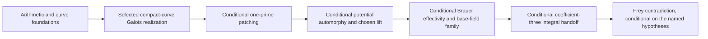

# FLT manuscript dependency graph

A row `X | A, B` means that manuscripts A and B supply substantial results used directly in
manuscript X. Rows are in stable topological order, so every numbered prerequisite is smaller
than its consumer. Purely transitive background is omitted unless the current manuscript
explicitly reuses that source.

`MATHLIB` denotes the assumed mathematical background visible in the local checkout. `CFT`
denotes the companion Class Field Theory development, including reciprocity and Brauer
invariants. Both are proof sources rather than mathematical axioms; unconditional closure also
requires their transitive imports to contain no proof gaps or extra axioms.

The graph records proved source manuscripts only. Named conjectural or unverified hypotheses
are not represented by invented book nodes; they appear after the table.

## Conditional proof spine

## Direct substantial prerequisites

| Book | Manuscript | Direct prerequisites |
|---:|---|---|
| 1 | Valuations, DVRs, and Completions | MATHLIB |
| 2 | Finite Extensions of Local Fields | 1 |
| 3 | Ramification Theory | 2 |
| 4 | Adeles and Ideles | MATHLIB |
| 5 | Local Class Field Theory | 1, 2 |
| 6 | Global Class Field Theory | 4, 5 |
| 7 | Analytic Foundations for Odlyzko--Poitou Bounds | MATHLIB |
| 8 | Ample Line Bundles, Hilbert Polynomials, and Symmetric Powers | MATHLIB |
| 9 | Divisors, Riemann--Roch, and Duality on Relative Curves | 8, MATHLIB |
| 10 | Faithfully Flat Descent in Algebraic Geometry | 8, MATHLIB |
| 11 | Normalization and Regular Models of Arithmetic Curves | 1, 8, 10 |
| 12 | Blowups and Intersection Theory on Arithmetic Surfaces | 9, 11 |
| 13 | Moduli Stacks for Modular and PEL Problems | 8, 10, MATHLIB |
| 14 | Arithmetic Spectral Sequences and Derived Cohomology | MATHLIB |
| 15 | Coherent Cohomology in Proper Families | 8, 14, MATHLIB |
| 16 | Semistable Curves, Dual Graphs, and Component Groups | 9, 11, 12, 10, 15 |
| 17 | Finite Étale Covers and Fundamental Groups | 10, MATHLIB |
| 18 | Derived Étale and $\ell$-adic Cohomology | 14, 17, MATHLIB |
| 19 | Proper and Smooth Base Change | 15, 18 |
| 20 | Étale Duality and Trace Maps for Curves | 18, 19 |
| 21 | Étale Sheaves and Cohomology on Curves | 16, 17, 18, 19, 20 |
| 22 | Nearby Cycles and Monodromy for Semistable Curves | 16, 18, 19, 20 |
| 23 | Lefschetz Trace Formulas for Curves | 18, 19, 20 |
| 24 | Continuous Cohomology of Profinite Groups | MATHLIB |
| 25 | Relative Picard Schemes and Jacobians | 9, 16, 10, 15 |
| 26 | Finite Locally Free Schemes and Algebras | 8, 10 |
| 27 | Affine Group Schemes and Hopf Algebras | 26 |
| 28 | Finite Flat Commutative Group Schemes | 26, 27, 10 |
| 29 | fppf Cohomology and Kummer Theory | 28, 10, MATHLIB |
| 30 | Local Galois Cohomology | 2, 3, 5, 24, 29 |
| 31 | Tate Local Duality | 5, 30 |
| 32 | Global Galois Cohomology and Selmer Groups | 6, 24, 30, 31 |
| 33 | Poitou–Tate Duality | 6, 31, 32 |
| 34 | Cartier Duality | 27, 28 |
| 35 | Abelian Schemes, Isogenies, and Polarizations | 26, 28, 34, 8, 10, 15 |
| 36 | Jacobians and $H^1$ of Curves | 21, 25, 35 |
| 37 | Weights and Weil Bounds for Curves and Abelian Varieties | 8, 20, 21, 23, 36 |
| 38 | Néron Models and Component Groups | 11, 16, 25, 35 |
| 39 | Integral Correspondences on Curves and Jacobians | 12, 16, 38, 36 |
| 40 | Descent and Weak Mordell--Weil for Abelian Varieties | 29, 35, 30, 32 |
| 41 | Heights, Mordell--Weil, and the Faltings--Tate Reduction | 2, 4, 8, 10, 11, 12, 13, 15, 25, 35, 36, 38, 40 |
| 42 | Finite-Flat Galois Representations | 2, 28, 34, 17 |
| 43 | Elliptic Curves over DVRs | 1, 2, 11 |
| 44 | Tate Curves and Multiplicative Reduction | 2, 43 |
| 45 | Torsion and Tate Modules of Elliptic Curves | 43, 44, 28, 34 |
| 46 | Algebraic de Rham Cohomology and Gauss--Manin Connections | 9, 15, 14, 35 |
| 47 | Betti, de Rham, and Étale Comparison for Curves | 9, 46, 21 |
| 48 | Divided Powers and Crystalline Sites | 14, MATHLIB |
| 49 | Crystalline Cohomology of Curves and Abelian Schemes | 25, 35, 46, 48 |
| 50 | Syntomic Cohomology and Integral Period Maps | 29, 34, 35, 48, 49 |
| 51 | Finite-Flat Group Schemes of Small Height | 2, 26, 27, 28, 34 |
| 52 | Dieudonné Theory and Raynaud Full Faithfulness | 42, 48, 49, 51 |
| 53 | Fontaine--Laffaille Modules and Torsion Representations | 46, 48, 49, 50, 52 |
| 54 | Integral Fontaine--Laffaille Equivalence and Base Change | 34, 42, 50, 52, 53 |
| 55 | $p$-divisible Groups and Serre--Tate Theory | 35, 49, 52, 54 |
| 56 | Ramification and Discriminants of Finite-Flat Representations | 3, 42, 51, 54 |
| 57 | Artinian and Complete Local Coefficient Rings | MATHLIB |
| 58 | Formal Schemes, GAGA, and Algebraization | 8, 15, 57 |
| 59 | Rigid Analytic Curves and Formal Models | 1, 11, 58 |
| 60 | Rigid Uniformization of Abelian Varieties | 59, 35 |
| 61 | Semistable Abelian Varieties and Monodromy | 3, 60, 38 |
| 62 | Pseudocompact Trace Algebras and Carayol Descent | 24, 57 |
| 63 | Deformation Functors of Representations | 24, 57 |
| 64 | Complete Local Algebra for Deformation Theory | 57 |
| 65 | Cotangent Complexes, Perfect Complexes, and Determinant Lines | 14, 64 |
| 66 | Representability of Deformation Problems | 24, 57, 63, 64 |
| 67 | Local Deformation Conditions Away from $\ell$ | 3, 30, 63, 66 |
| 68 | Finite Flat Deformation Conditions at $\ell$ | 31, 42, 30, 63, 66, 54 |
| 69 | Global Deformation Problems | 32, 33, 66, 67, 68 |
| 70 | Depth, Complete Intersections, and Fitting Ideals | 64 |
| 71 | Numerical Criteria for $R=T$ | 64, 70 |
| 72 | Smooth Representations of $p$-adic Groups | MATHLIB |
| 73 | Parabolic Induction, Jacquet Modules, and Whittaker Models for $\mathrm{GL}_2$ | 72 |
| 74 | Dihedral Supercuspidals, Types, and Newvectors for $\mathrm{GL}_2$ | 2, 72, 73 |
| 75 | Weil--Deligne Representations and Local Constants | 2, 3, 24, 72 |
| 76 | Local Langlands in the Principal, Special, and Dihedral Cases | 5, 73, 74, 75 |
| 77 | Quaternion Algebras over Number Fields | 1, 2, 6, CFT |
| 78 | Characters and Dihedral Types on Quaternion Division Algebras | 77, 72, 74 |
| 79 | Representations of Quaternion Division Algebras | 72, 74, 77, 78 |
| 80 | Local Jacquet--Langlands for Special and Dihedral Packets | 73, 74, 75, 76, 79, 78 |
| 81 | Cyclic Base Change: Local Theory | 3, 5, 73, 74, 76, 80 |
| 82 | Orders in Quaternion Algebras | 3, 77 |
| 83 | Automorphic Forms on Definite Quaternion Algebras | 4, 82 |
| 84 | Hecke Operators on Quaternionic Forms | 72, 77, 82, 83 |
| 85 | Hecke Algebras and Congruences | 57, 64, 84 |
| 86 | Schwartz–Bruhat Analysis and Tate’s Thesis | 4, 5 |
| 87 | Archimedean GL₂ and Discrete Series | MATHLIB |
| 88 | Hilbert-Space Spectral and Trace-Class Theory | MATHLIB |
| 89 | Sobolev Theory and Elliptic Regularity on Arithmetic Quotients | 87, 88 |
| 90 | Reduction Theory and the Cuspidal Spectrum of $\mathrm{GL}_2$ | 4, 72, 87, 88, 89 |
| 91 | Global Constant Terms and Eisenstein Contributions for $\mathrm{GL}_2$ | 86, 90 |
| 92 | Global Whittaker Models and Rankin–Selberg Theory | 73, 86, 90 |
| 93 | Analytic Theory of Automorphic Rankin–Selberg L-functions | 75, 92 |
| 94 | Strong Multiplicity One and Global Newforms for $\mathrm{GL}_2$ | 73, 76, 90, 92, 93 |
| 95 | Automorphic Representations of $\mathrm{GL}_2$ | 4, 73, 87, 90, 92, 94 |
| 96 | Automorphic Representations of $D^\times$ | 4, 77, 79, 83, 86, 88, 89, 90, 91, 92, 94, 95 |
| 97 | Algebraicity and Integral Structures of Weight-Two Packets | 85, 95, 96, 47, 46, 94 |
| 98 | Hecke Characters and Automorphic Induction from $\mathrm{GL}_1$ | 6, 76, 86, 97 |
| 99 | Cuspidal Trace-Formula Kernels for Rank Two | 88, 90, 91, 89 |
| 100 | The Cuspidal Spectral Side of the $\mathrm{GL}_2$ Trace Formula | 90, 91, 99 |
| 101 | The Geometric Side of the GL₂ Trace Formula | 99 |
| 102 | Orbital Integrals for $\mathrm{GL}_2$ and Quaternion Algebras | 73, 74, 75, 79, 80, 87 |
| 103 | Transfer of Test Functions and the Rank-Two Fundamental Lemma | 80, 102, 101 |
| 104 | Global Jacquet--Langlands | 80, 95, 96, 97, 100, 101, 103 |
| 105 | Twisted Conjugacy and Geometric Trace Distributions | 95, 81 |
| 106 | Twisted Cuspidal Trace Kernels and Spectral Expansion | 81, 91, 94, 100, 101, 105 |
| 107 | Twisted Orbital Matching and the Cyclic Fundamental Lemma | 81, 102, 105 |
| 108 | Cyclic Base Change for $\mathrm{GL}_2$ | 80, 81, 95, 96, 102, 103, 105, 106, 107 |
| 109 | Solvable Base Change and Descent | 6, 24, 81, 77, 95, 104, 98, 108 |
| 110 | Generalized Elliptic Curves and Level Structures | 43, 44, 45, 8, 13 |
| 111 | Compactified Modular Stacks and Coarse Modular Curves | 8, 11, 13, 110 |
| 112 | Deligne--Rapoport Integral Models of Modular Curves | 11, 12, 16, 51, 110, 111 |
| 113 | Integral Modular Forms and q-Expansion | 9, 15, 110, 111 |
| 114 | Modular Jacobians, Néron Models, and Hecke Correspondences | 25, 38, 39, 112, 113 |
| 115 | Reductive Groups, Inner Forms, and Corestriction in Rank Two | 77 |
| 116 | CM Abelian Varieties, Types, and Reflex Norms | 1, 6, 35 |
| 117 | Complex Multiplication, Reciprocity, and Reduction | 5, 6, 10, 13, 61, 52, 116 |
| 118 | Shimura Data and Canonical Models in the FLT Cases | 4, 115, 116, 117 |
| 119 | Quaternionic PEL Functors and Representability | 10, 13, 65, 35, 115, 118 |
| 120 | Uniformization, Components, and Hecke Descent for Shimura Curves | 58, 39, 118, 119 |
| 121 | Good Integral Models of Quaternionic Shimura Curves | 15, 58, 19, 35, 36, 61, 55, 118, 119 |
| 122 | Semistable Models and Monodromy of Quaternionic Shimura Curves | 6, 10, 11, 12, 13, 16, 17, 20, 22, 35, 37, 58, 70, 76, 118, 119, 120, 121 |
| 123 | Modular and Shimura Curves | 110, 111, 112, 114, 115, 116, 118, 119, 121, 122, 120 |
| 124 | Hecke Correspondences on Curves and Jacobians | 39, 83, 84, 114, 120, 123 |
| 125 | Automorphic Decomposition of Shimura-Curve $H^1$ | 21, 47, 36, 96, 104, 87, 124, 118, 119, 120 |
| 126 | Galois Representations from Weight-Two Shimura-Curve Cohomology | 17, 21, 47, 115, 125 |
| 127 | Galois Representations Attached to Weight-Two Automorphic Forms | 37, 104, 125, 126 |
| 128 | Local--Global Compatibility for Weight-Two Galois Representations | 22, 41, 61, 75, 76, 104, 118, 121, 122, 125, 126 |
| 129 | Galois Lattices and Finite-Flat Closures in Abelian Tate Modules | 35, 26, 27, 28, 34, 42, 45, 52, 53, 54, 125, 126 |
| 130 | Modular Curves $X_0(N)$ and $X_1(N)$ | 110, 111, 112, 113 |
| 131 | Jacobians of Modular Curves | 47, 25, 35, 38, 40, 113, 114, 130 |
| 132 | Eisenstein Series, Congruences, and the Eisenstein Ideal | 85, 113 |
| 133 | Cuspidal Divisors and Specialization on Modular Jacobians | 16, 38, 114, 132 |
| 134 | Mazur–Raynaud Admissible Group Schemes | 28, 34, 29, 51, 133 |
| 135 | Genus-Two Curves, Jacobians, and Abel--Jacobi Geometry | 9, 37, 25, 41, 130 |
| 136 | Mumford Representations and Exact Genus-Two Jacobian Arithmetic | 37, 135 |
| 137 | Explicit Two-Descent on Genus-Two Jacobians | 40, 136 |
| 138 | Integral Local Types and Type Lattices | 17, 21, 22, 51, 53, 54, 73, 74, 75, 76, 122 |
| 139 | Ihara Theory and Saturated Degeneracy Maps on Shimura Curves | 4, 5, 6, 16, 24, 38, 39, 85, 118, 122, 124 |
| 140 | Integral Level Change and Jacquet--Langlands Comparison | 22, 80, 85, 104, 122, 125, 138, 139 |
| 141 | Dickson Classification and Adequate Residual Image | 3, 6, 45, 42, 24 |
| 142 | The Chebotarev Density Theorem | 2, 3, 4, 5, 6, 7, 17, 21, 23, 24 |
| 143 | Taylor–Wiles Primes | 5, 6, 33, 69, 141, 142 |
| 144 | Taylor–Wiles Systems | 69, 143 |
| 145 | Patching Modules and Rings | 69, 70, 144 |
| 146 | The Abstract $R=T$ Argument | 71, 145 |
| 147 | Completed Hecke Pieces and Eisenstein $p$-divisible Groups | 28, 34, 35, 38, 51, 55, 57, 85, 114, 132, 133, 134, 142 |
| 148 | Eisenstein Descent and the Mordell--Weil Group of the Eisenstein Quotient | 31, 32, 40, 41, 132, 133, 134, 147 |
| 149 | Eisenstein Cotangent Lattices and Formal Immersion | 9, 15, 113, 114, 147, 148 |
| 150 | Mordell--Weil Sieves for Hyperelliptic Curves | 41, 149, 136, 137 |
| 151 | Semistable Full-Two Residual Irreducibility | 6, 35, 42, 44, 45, 51, 149, 150 |
| 152 | Deep-Level Quaternionic Modules and Diamond Actions | 144, 82, 83, 84, 85, 139 |
| 153 | Hilbert Irreducibility and Arithmetic Approximation | 2, 17, 37 |
| 154 | Moret–Bailly’s Theorem | 8, 9, 10, 40, 41, 58, 153 |
| 155 | Galois and Solvable Refinements of Arithmetic Approximation | 2, 6, 153, 154, 142 |
| 156 | Hilbert--Blumenthal Moduli and Two-Prime Level Covers | 17, 10, 13, 35, 55, 115, 116 |
| 157 | Local Geometry of Hilbert--Blumenthal Moduli | 2, 8, 10, 37, 43, 44, 45, 51, 52, 54, 55, 58, 60, 117, 154, 155, 156 |
| 158 | Moduli Constructions for Potential Modularity | 156, 157 |
| 159 | Discriminants of Galois Representations | 3, 56 |
| 160 | Odlyzko Bounds and Fontaine's Argument | 7, 56, 159 |
| 161 | Schoof's Finite-Flat Category over $\mathbf Z[1/2]$ | 2, 3, 17, 28, 29, 34, 42, 51, 55, 56, 160 |
| 162 | Quintic Cyclotomic Units and Kummer Arithmetic | 1, MATHLIB |
| 163 | Cyclotomic Descent for Quintic Fermat-Type Equations | 162 |
| 164 | The Frey Curve: Arithmetic Reduction and the Exact Modular-Method Handoff | 43, 44, 45, 151, 163 |
| 165 | Local Conditions for Hardly-Ramified Minimal Deformations | 30, 31, 32, 44, 63, 66, 67, 68, 164 |
| 166 | Supported Galois Cohomology and Selmer Calculations | 24, 30, 31, 32, 33, 69, 165 |
| 167 | Relation Obstructions and Poitou--Tate Corrections | 165, 166 |
| 168 | Compatible Coefficient Systems and Purity | 41, 97, 118, 122, 127, 128, 142 |
| 169 | The Eisenstein Ideal | 85, 113, 114, 131, 132, 133, 134, 147, 148, 149, 142 |
| 170 | Hecke-Valued Galois Representations and Nonminimal Reciprocity | 68, 69, 85, 127, 128, 138, 140, 62, 142 |
| 171 | The Minimal Totally-Real Deformation--Hecke Problem | 69, 71, 85, 124, 127, 65, 138, 170, 141 |
| 172 | Minimal Patching and $R=T$ over Totally Real Fields | 141, 143, 144, 145, 146, 152, 171 |
| 173 | Minimal Modularity Lifting | 171, 172 |
| 174 | One-Prime Type Complexes and Component Support | 6, 17, 21, 22, 65, 67, 69, 70, 118, 119, 121, 122, 125, 138, 139, 140, 141, 143, 145, 152, 170, 171, 172 |
| 175 | One-Prime Nonminimal Patching and R=T | 67, 69, 109, 138, 139, 140, 143, 170, 171, 172, 173, 174 |
| 176 | Nonminimal Modularity Lifting | 6, 14, 22, 84, 109, 122, 123, 124, 125, 138, 139, 140, 143, 145, 152, 170, 173, 174, 175 |
| 177 | Potential Modularity of Two-Dimensional Representations | 104, 98, 127, 176, 154, 158, 142 |
| 178 | Auxiliary Dihedral Data and Residual Potential Modularity | 6, 104, 98, 127, 141, 175, 154, 142, 155, 156, 157 |
| 179 | Compatible Systems of Galois Representations | 168, 141, 142 |
| 180 | Brauer Induction and Descent of Automorphy | 24, 75, 98, 109, 168 |
| 181 | Finite Image and the Balanced Minimal-Lift Argument | 57, 62, 64, 141, 164, 165, 166, 167, 173 |
| 182 | Potential Automorphy and Galois Refinement of a Chosen Lift | 6, 37, 44, 61, 104, 109, 118, 121, 122, 124, 125, 127, 128, 140, 142, 153, 154, 155, 157, 164, 165, 168, 173, 176, 178, 181 |
| 183 | Brauer Induction for Automorphy Families | 41, 98, 108, 109, 127, 128, 142, 168, 180, 182 |
| 184 | Brauer Characters and Effectivity of Compatible Families | 24, 57, 180, 183 |
| 185 | Compatible Systems over the Base Field | 168, 180, 182, 183, 184 |
| 186 | Changing the Coefficient Prime while Keeping the Frey Special Place | 185 |
| 187 | The Fixed-Three Integral Local Theory | 3, 6, 10, 26, 42, 54, 82, 118, 119, 121, 125, 127, 128, 129, 161, 182, 185, 186 |
| 188 | Hardly Ramified $3$-adic Representations | 161, 185, 187 |

## Named unresolved theorem hypotheses

These conditions are assumptions or missing source theorems, not dependency nodes, except for
the interfaces explicitly marked closed below. The list is deliberately separate from the
acyclic manuscript graph so that the closed record cannot be mistaken for a remaining blocker.

- **Localized abelian Ihara:** vanishing, at every actual routed constant-coefficient level, of
  the localized $\Delta$-invariant sum of transgression kernels on the $K_c^v$-invariant
  continuous odd-primary characters of the full profinite congruence kernels. Book 139 proves
  that this is exactly the noncongruence-character quotient required for saturated two-map
  Ihara, proves spectator-level invariance of the underlying kernel for fixed $(F,B,v)$, and
  gives the exact compact finite-coefficient transgression quotient. Kernel invariance does not
  transport centrality from a smaller completion to a larger one. The exact unresolved
  application gate is $({\rm AC}^{\rm loc}_\ell)_{\mathscr R}$. Book 139 proves neither that
  vanishing nor the stronger $({\rm R2CM})_{F,B,v}$ package: its first missing assertion is the
  reference-level rank-two centrality theorem, followed by the perfect adelic
  pairing, split/division local multiplier classification, and restricted-product/no-cross-factor
  reduction that could imply it. Routed centrality is not formal from the reference level, but
  would follow after the full package from the resulting order-at-most-two bound. Book 6 does
  prove the terminal scalar cokernel is the dual of the global roots of unity; the missing
  multiplier theorem must construct the injection into that cokernel.
- **Type and node comparison:** objectwise normalization of the actual principal/ray tower,
  the ray factor, and the finite-wild/procyclic ramified strict-node complex are proved in Books 122,
  22, and 174; the common-normalization lemma makes the lifted principal legs isomorphisms.
  Book 122, Proposition 9.3 proves the level-one Drinfeld-basis normalization, and
  (9.29k)--(9.29l) prove every active finite-depth normalization and intermediate invariant
  ring.  Equations (9.29r)--(9.29x) compute the raw higher branches, inertia, inseparable
  residue degrees, node-annular complexes, and boundary stabilizers.  Its level-one divisor,
  stabilizer, and Bruhat calculations give the exact wild-invariant extreme lines,
  constant-extreme-line generization, and unique
  multiplicity-one node sheet; Proposition 9.4 promotes routing, multiplicity and expansion
  one, and Hecke/transpose compatibility to the actual common factor.  Proposition 9.5
  calculates the reduced invariant branch fields, Cartier multiplicities and group filtrations,
  and reduces the normalized spectator/ray compositum to the residue-field factorization of
  $T^c-\bar u^{-1}$ and the actual local intersection field. Proposition 9.6 factors every
  completed endpoint and blowup chart once the actual endpoint valuation, leading coefficient,
  and tame subgroups are supplied. Proposition 9.7 gives the exact Milnor-tube construction;
  Proposition 9.8 proves $({\rm RGC}_v)$ on noncontracted and contracted component terms, with
  refined excess, Frobenius--Hecke compatibility, and transpose.  For the permutation and
  quotient/augmentation rows, Proposition 9.9 constructs the strict ray quotient and computes
  its local field, vertical unit, endpoint factors, Frobenius orbits, and active/ray
  intersection. Proposition 9.10 computes the completed tubes, actions, and generization maps,
  and Corollary 9.11 proves $({\rm KBL}_v)_{\rm act}$, $({\rm BTK}_v)_{\rm act}$,
  $({\rm HDB}_v)_{\rm act}$, and $({\rm PNS}_v)_{\rm act}$.  Thus Book 174's
  $({\rm TPE}_v)$ reduction is closed for its actual rows; arbitrary intermediate
  representations and arbitrary cyclic ray data still require the corresponding general
  Kummer--tube and branch-descent targets. Unit-order coarse descent remains the separate
  $({\rm TIC}_v)$ input. The later
  type algebra has now been reduced further.  Under those geometric hypotheses and the named
  abelian-Ihara family, for the actual quotient/augmentation flag pair, when $q_v+1$ is a
  coefficient unit the integral flag idempotent makes type-Ihara and primitive residue direct
  summands of the Shapiro constant rows; even in the nonbanal range the
  augmentation-companion pull is automatic.  At $q_v\equiv-1\pmod\ell$ the exact remaining
  type inputs are the quotient-new injection (Book 174, (5.0d)) and the primitive
  filtered-cofiber comparison (6.0d).  Proposition 5.0A identifies the first with primitivity
  of the integral constant-vector map on the actual arithmetic new cokernels, equivalently
  injectivity of the residual new Bockstein into the augmentation companion; the relation
  $VU=q_v+1$ kills the possible index only after inverting $q_v+1$.  Proposition 6.0A proves
  that, once the actual type-incidence row and type-Ihara are supplied, the generic old cokernel already commutes with the
  coefficient row, so (6.0d) is precisely a global filtered-normalization/graph-cycle
  strictness theorem rather than another old-image saturation problem.  Superspecial node
  uniformization remains the enhanced flagged PEL node-groupoid classification, isolated as
  Book 140, (5.9a); once that equivalence and all of its enhancements are supplied, its
  transport of the quotient/augmentation representations is formal; changing prime-to-$v$
  level leaves the local node chart fixed while changing the groupoid, so the classification
  cannot be derived from the local models.  The local special closure and its full
  scalar/vexing boundary coordinates are proved.  The minimal, boundary, and special problems
  can also be placed on one marked Taylor--Wiles diagonal, and their common boundary quotient
  survives patching.  The remaining $({\rm BCD}_v)$ input for one-prime component support is
  the relative Cartier-switch transversality theorem (Book 174, (8.2f)): nonvanishing or
  regular-sequence transversality of the lower boundary block and relative formal smoothness
  of the special monodromy relaxation.  Dimension balance and unique-component routing are
  formal once that theorem is supplied, not another calculation of the local equation.
  Relative to the separately
  named localized abelian Ihara input, constant-coefficient generic support in the clean special
  block is proved in Book 140 from Book 125 and is not another unresolved hypothesis. After the
  typed filtration exists, Book 174 likewise proves the typed generic-residue kernel equality
  from Book 125 and contracts it to equality of the integral faithful image orders; no separate
  generic-support or faithful-order hypothesis remains at that interface.
- **Raw signed-special carrier:** Book 122 constructs the non-common-norm unitary dyadic
  parahoric source, but does not identify it integrally with the basic quaternionic packet
  carrier. Its finite integral comparison (10.5), including the unramified component field and
  expansion-one branch routing, remains required before that source can serve as the FLT raw
  signed-special carrier. This is separate from Ihara saturation and from the raw-to-global
  semisimplification interface.
- **One-prime generic rigidity:** for Book 175's scalar-residual line-special problem, after
  the reduced comparison it uses the balanced enhanced obstruction presentation and finiteness
  to prove vertical torsion-freeness of the
  conductor-one global deformation ring. The line remains compulsory in the residual complex;
  at a monodromy-zero characteristic-zero point its tangent is uniquely determined by the
  distinct Frobenius characters. Book 175 identifies vanishing of every characteristic-zero
  enhanced tangent--Selmer group with global reducedness and full $R=T$. Under the coherent
  unpadded $({\rm AUX}_Q)$ system, it then proves that vanishing: at every depth the arithmetic
  input must first supply a clean shadow with exactly $q$ ordered primes killing the recomputed
  enhanced dual group, together with the effective torsor and marked augmentation data.
  Coherence is obtained only after those exact-$q$ shadows exist. The enhanced balanced count
  gives an absolute regular source with the same $q$ variables as the diamond source, and Book
  174's nonzero module free over the diamond source makes the equal-variable action faithful.
  Thus the patched ring is regular and the finite conductor-one ring satisfies full $R=T$.
  Without a coherent exact-$q$
  auxiliary system, the branchwise torsion-cotangent theorem isolated in Corollary 4.4a is the
  exact alternative input; finite flatness and topological support alone do not imply it.
  Book 172 derives minimal acting-order augmentation only after minimal $R=T$; Book 174 proves
  fixed-prime acting-order augmentation from the strict global twist and proves auxiliary
  represented-ring, primary/companion complex, module, action, and pairing augmentation while
  retaining only a surjection on auxiliary acting images; Book 175's balanced patch supplies
  generic rigidity and then makes that last surjection injective, with the strict ray twist
  additionally retained for the scalar family. No separate one-prime
  acting-order theorem remains in that faithful range.
- **Several active places:** once one actual product coefficient system and all component
  routes are supplied, Books 123--124 and 174 formally construct the coherent generic global
  level cube and its adjoint companion. Book 84, Section 11.9 already constructs the integral
  $2^{|P|}$-fold degeneracy source on one definite global module and its product Gram formula;
  Book 152, Proposition 11.1 constructs the commuting regular-refinement idempotents on that
  same kind of source. These are the owners of common-carrier commutation and source splitting,
  not of mixed quotient exactness. Book 125's packetwise restricted tensor factorization puts its
  generic fiber in top degree, with the global multiplicity module occurring only once; it does
  not kill lower $\varpi$-power torsion or residual hyper-Tor over a larger face base. Book 176
  identifies the two-place residual obstruction over the final coefficient DVR with the
  torsion in the top joint-new quotient, equivalently failure of primitivity for the sum of
  the two top old images; its split-edge countermodel shows that generic concentration and
  separate primitivity do not force this sum to be primitive. Distinct arithmetic fibers have
  empty intersection, so a literal multi-trait component fiber is unavailable. Book 176
  constructs the parity-correct cube of quaternionic inner forms and proves generic
  packet-label commutation with the common multiplicity inserted once; the unresolved
  geometric input is the routed integral derived iterated-switch Beck--Chevalley homotopy with
  component/branch terms and higher coherence. Full simultaneous component support also
  remains unresolved. Book 14 already supplies formal derived base-change pasting once the
  higher maps exist, and Book 145 supplies the support--annihilator implications; neither
  constructs the missing arithmetic maps or product-component occurrence. Book 176,
  Proposition 8.3 constructs the joint scalar ray quotient; (8.26) gives the strict product
  twist only on an already constructed routed joint cube equivariant for that quotient. Book
  143 gives represented-ring augmentation for the product
  problem under its ordered-distinct-root hypotheses.  One common equivariant auxiliary
  package, including the full vertexwise ordered-root and old/new hypotheses of Book 174,
  Proposition 9.1, gives coherent complex--module--action--pairing augmentation objectwise;
  fixed-prime faithful-order
  augmentation is formal once the joint strict product twist exists, while auxiliary
  acting-image injectivity follows after full base $R=T$ and is not a separate input to the
  reduced finite-level comparison.  Book 170 already proves finite-set reciprocity once the
  actual joint carrier, simultaneous generic local labels, integral coefficient-prime
  realization, and exact trace/structural generation have been verified; its reduced-order
  argument then supplies the all-Artinian factorizations.  Those joint inputs do not follow
  from separate one-prime carriers. For one named characteristic-zero point, Book 176 also
  constructs the canonical torsion-free top/adjoint carrier directly from the actual cube.
  Its smaller pointwise interface needs simultaneous branch verification and reciprocity on
  that carrier, followed by occurrence of the single global product component through the
  point; mixed exactness and product residue are needed only if used to prove that occurrence.
- **Controlled residual automorphic seed:** Book 157 proves the paired-frame Kummer
  normalization, a simultaneous regular projective equivariant fan, finite-field Bertini,
  stable DVR slicing conditional on a supplied joining model, the complete-trait inverse, the Mumford-side completed ring, and the
  formal family-theta/base-fan calculation.  Its first missing relative input is Required
  $(\mathrm{IIT})$: labelled reduced data do not force a square-zero smoothing coefficient to
  be the fixed logarithmic monomial times a unit.  Required $(\mathrm{MPE})$ follows only
  conditionally.  Required $(\mathrm{ACE})$ then retains the bounded conductor presentation
  $(\mathrm{BCP})$ and single-chart effectivity $(\mathrm{AEC}_0)$, ramified conductor descent
  $(\mathrm{RCD})$, and theta--determinant cusp theorem $(\mathrm{TDC})$.  Proposition
  13.2B.3b conditionally proves paired-frame normalization and finite-etale twist descent from
  that complete unframed package.  Thus Required Theorem 13.2B.3,
  $(\mathrm{TCG})_\Sigma$, Required $(\mathrm{FTJ})_{v_0,Z}$, and Required
  $(\mathrm{ICS})_{v_0,Z}$ remain conditional.  A singleton common moving presentation also
  requires the separately stated repeatability, flexibility, and realized-normal-closure
  hypotheses.  The literal marked-good-section form additionally retains Book 157's necessary
  finite-residue rational-point condition, but that stronger form is not used.
  Book 158 does not import this singleton chain into the FLT route.  Starting from its fine
  interior and simultaneous split point-centered local opens, it chooses Book 154's moving
  pencil simply branched; Book 153's transposition calculation gives a regular $S_d$ normal
  top, and Book 155 specializes that top with total reality, complete splitting, and
  closure-level avoidance.  Thus the split potential-modularity handoff needs none of
  $(\mathrm{IIT})$, $(\mathrm{MPE})$, $(\mathrm{ACE})$, $(\mathrm{TCG})_\Sigma$,
  $(\mathrm{FTJ})_{v_0,Z}$, or $(\mathrm{ICS})_{v_0,Z}$.  A stronger controlled seed with one
  exceptional factor would still need its own common moving presentation and is not inferred
  from this split theorem.
  In the multiplicative-$\ell$
  Frey branch, Book 157 constructs the one-prime good ordinary $\mathbf Q_\ell$ seed
  $({\rm Ord}^{\rm base}_\ell)$ carrying the exact selected $\ell$-model.  Its
  Proposition 8.4B constructs it by Serre--Tate theory, and Lemma 8.4B.1 constructs the
  trace-one finite-field seed from Book 117's ring-class reciprocity and
  potential-good-reduction package.
  Book 182, Lemma 6.2B shows that the formerly frozen multiplicative auxiliary branch may be
  incompatible with every good seed; Proposition 6.2C therefore reselects $q$ and retargets
  that branch, after which it constructs corrected $({\rm FF}^{\rm base}_\ell)$ with both
  exact frames, neat level, component, and avoidance.  The Tate seed itself realizes only the
  residual finite-flat $\ell$-torsion and Book 140 cannot change level at the coefficient
  prime; after the resulting normal-top
  specialization, actual auxiliary-prime lifting certificates and an ordered target-prime path
  whose every current edge satisfies Book 140's
  abelian-Ihara, saturation, duality, full-monodromy, component, branch, normalization, and
  nonexceptional hypotheses, together with exact saturated inter-edge localizations and the
  bottom Book 173 structural ledger.  The auxiliary-$q$ active set and the later target set
  are separate ledgers even when places, notably the full conjugate distinguished set
  $W_0(M)$, occur in both.  In the Frey-adapted
  construction every dyadic place is forced into the auxiliary-$q$ active set but is absent
  from the target set because the target retains its SP condition; hence Book 178's literal
  singleton is unavailable and the auxiliary step needs an ordered route-appropriate chain or
  the genuine Book 176 finite-set datum.  A retained multiplicative place above $3$ belongs to
  both ledgers, while an unrepaired multiplicative place above $\ell$ prevents the target path
  altogether.  Once the split target
  packet and its actual extra set are known, Book 182 formally uses Books 104 and 125 to place it on a
  path-compatible compact carrier ramified at one retained dyadic SP place and therefore split
  at every target-extra place; a primitive upper packet lattice gives nonzero occurrence there;
  Book 182, Proposition 7.1A proves from those data that every lower localization, including
  the clean bottom minimal SP localization, is nonzero; its final definite occurrence uses
  Book 104's forward transfer from the path carrier followed by its totally definite inverse
  transfer and a primitive saturated packet lattice, not an integral
  Jacquet--Langlands comparison at either carrier switch; and the later controlled raw-local record, including a raw
  dyadic SP carrier in the
  remaining even-degree minimal case.  Full principal/dihedral descent complexes, type and
  exchange lines, tameness, zero monodromy, and Frobenius return maps at retained auxiliary
  primes remain a separate stronger automorphic-type problem.  Equivariant conductor and
  invariant-Frobenius independence construct the weaker unramified Galois pairs and remove
  the type geometry from the clean-support path. Book 128, Lemma 3.2 gives the
  zero-monodromy raw-to-global comparison formally.
  Book 182 now constructs parity-complete basic carriers and attachment for
  the cyclic descent candidates, including odd-degree fixed fields.  The lifting faces also
  require the separately named one-prime and several-place inputs above. Once actual raw SP
  carriers exist, Books 128, 168, and 183 close the formal nonzero-monodromy raw-to-global
  reduction; the remaining arithmetic input for that SP record is the separately named
  packet-carrier ambient semisimplicity theorem below.  Book 178's protected
  anti-cyclotomic Grunwald correction lets Book 182 impose the exact unramified auxiliary
  Frobenius values at $2$, $3$, and $\ell$; it then constructs the exact paired Frey/auxiliary frames
  over $\mathbf Q_2$, $\mathbf Q_3$, and $\mathbf Q_\ell$ by adapting the local elliptic seeds and neat source.
  In the multiplicative-$\ell$ branch, Book 157 supplies $({\rm Ord}^{\rm base}_\ell)$ and
  Book 182, Proposition 6.2C then supplies corrected $({\rm FF}^{\rm base}_\ell)$.  In the
  good-reduction branch Proposition 6.2A supplies the coefficient-prime point directly.  In
  both branches Book 182's Required Moving Theorem 6.3 remains conditional on Book 157's
  Required $(\mathrm{TCG})_\Sigma$ or another genuine moving repair.  Once that presentation is
  supplied, Book 182 forces constant-field avoidance with split Chebotarev certificate primes
  and proves the remaining
  normal-closure control, applies Book 178's corrected relative-ray compatibility in the
  rational-base Frey case, and takes the top
  itself as seed field, makes upward transfer vacuous, and reduces the local and group-theoretic
  descent checks to Book 109. Its parity-complete carrier theorem supplies the distinguished
  attachment and cyclic compatibility for every candidate descent. Book 178's general totally-real-base ray hypothesis remains
  separate.
- **Balanced-lift finiteness:** no separate restricted reduced-finiteness hypothesis remains.
  From the exact automorphic seed, Book 173 makes the whole restricted ring finite free and Book
  181 derives finite scalar image, whole-ring finiteness, finite flatness, and a horizontal
  characteristic-zero point.  Its sole unresolved arithmetic input is therefore the seed above.
- **Packet-carrier ambient semisimplicity $(\mathrm{SS}_{\mathrm{array}})$:** for every actual
  smooth projective curve carrier used in the finite Brauer packet array and every relevant
  coefficient characteristic $q$, its rational $H^1_{\mathrm{et}}$ is semisimple as a global
  Galois module. Books 128, 168, and 183 prove that this input survives finite coefficient
  extension, packet idempotents, and Morita extraction, so each raw multiplicity representation
  equals its global semisimplification. It therefore preserves the complete signed special
  Weil--Deligne pair, including nonzero $N$, its line, and its Frobenius sign, at every
  coefficient embedding with $q\ne2$. Book 41 now proves, without Hom--Tate surjectivity, the
  complete chain from finiteness of each carrier Jacobian's $K$-isogeny class to rational
  Tate-module semisimplicity $(\mathrm{TS})$ and thence to
  $(\mathrm{SS}_{\mathrm{array}})$. It also proves the Faltings-height isogeny formula and the
  formal moduli-Northcott reductions. The first exact arithmetic input is finiteness of the
  carrier Jacobians' $K$-isogeny classes. A standard uniform source is
  Faltings--Shafarevich finiteness. Book 41 proves finite polarized $K$-descent after
  Northcott, normalized-lattice compactness, Jordan--Zassenhaus for orders in semisimple
  rational algebras, direct-summand finiteness, and hence integral Zarhin cancellation. Its new
  internal sketches do not yet prove potential semistable reduction, persistence and ramified
  semistable Hodge base change, the arithmetic toroidal Siegel compactification, or the integral
  metrized Hodge--theta comparison from the permitted earlier sources. Book 41 proves the
  Hermitian determinant/saturation identity, a finite Pl\"ucker upper-slope criterion, and the
  formal deduction of (13.3r). That deduction remains conditional on the separately named
  $(\mathrm{AHS}_{\log})$ and $(\mathrm{US}_\theta)$ certificates: exact determinant
  characters, boundary primitivity, positive level-prime divisibility, cusp-normalized norms,
  and universal integral Pl\"ucker frames. The blocker therefore cannot honestly be narrowed to
  the abstract slope deduction or removed, and the four geometric/metric gates remain
  separately required.
  This is separate from constructing the raw dyadic carriers. At $q=2$ the conditional theorem
  proves global semisimplicity but does not extend the prime-to-coefficient Weil--Deligne
  comparison at the dyadic base place; Book 184's $(\mathrm{AI}_2)$ remains a separate
  effectivity gate.
- **Coefficient-two top-packet irreducibility $(\mathrm{AI}_2)$:** absolute irreducibility in
  characteristic zero of the already existing top-packet realization at every coefficient
  place of residue characteristic two. It is a uniform sufficient input for the Mackey Gram
  calculation at residue characteristic two and hence for Book 185's all-place effectivity;
  it is not a scalar extension or completion of the away-from-two collection. Relation by
  relation, the exact numerical input is norm one for the signed class at residue characteristic two
  $(\mathrm N_2(\mathfrak B))$; the existing proof obtains it from coefficient-independence of
  the finitely many self-twist Hom dimensions $(\mathrm G_2(\mathfrak B))$. A sufficient
  natural source theorem would be coefficient-prime semistable SP compatibility with nonzero
  monodromy for the top packet, which implies $(\mathrm{AI}_2)$, but Books 128 and 168 do not
  prove it. The coefficient-three route through Books 186--188 uses only places away from two
  and does not use this hypothesis.
- **Closed: positive fixed-three packet carriers $(\mathrm{AVCar}_{3,\ell}^+)$,
  $(\mathrm{Car}_3^+)$, and $(\mathrm{IC}_3)$:** name $3$ among the split sensitive places
  before constructing the controlled top. Book 182 now supplies the corresponding split
  evaluated packet over $\mathbf Q_3$ and parity-complete basic carriers for every elementary
  term. Book 118 constructs the required replacement for the impossible direct common-norm
  group: after adjoining an imaginary quadratic field nonsplit at $2$ and split at $3\ell$,
  its unitary common-multiplier group is PEL-exact, has the same adjoint one-split datum, and
  finitely dominates every routed basic component after CM base change. The trivial central
  character permits central saturation of the basic level; its connected fiber-product argument
  then identifies the comparison component at a preliminary coarse unitary level, passes to a
  fine unitary level away from $3\ell$, and chooses its component field unramified there.
  Book 121 verifies the split odd
  hyperspecial local model and excludes its boundary by anisotropy of the reduced-norm
  Hermitian space. Weil restriction of the product of component Jacobians returns a good
  abelian carrier over the elementary fixed field. Thus Book 187, Proposition 2.2 proves
  $(\mathrm{Car}_3^+)\Rightarrow(\mathrm{AVCar}_{3,\ell}^+)$ by rational pullback. Theorem
  2.3 then uses nonzero-oldvector embeddings,
  semisimplification, commensurability, local Mackey decomposition, saturated intersection,
  and schematic closure to construct the flat companion $(\mathrm{IC}_3)$. No integral
  packet idempotent, negative-term carrier, or integral Brauer cancellation is required.
  Thus $(\mathrm{IC}_3)$ is not an independent post-assembly field of the admitted
  compatible-family arithmetic core. This is a positive-only geometric construction, not
  integral Brauer effectivity. Book 118's parity
  calculation remains essential: it proves that changing the multiplier, order, or level of
  the direct trace group cannot produce the cover; the CM-unitary center is genuinely
  different. Ambient
  Tate-module semisimplicity is unnecessary for this fixed-three substatement
  because Book 129 transfers the finite-flat tower from the raw plane to its semisimplification
  by subquotients.
- **Auxiliary Galois comparison and clean support:** Book 61, Proposition 12.3 makes both the
  Artin conductor and the inertia-invariant Frobenius polynomial of an actual Jacobian Hecke
  multiplicity factor coefficient-independent. Book 182, Proposition 7.2B anchors them at the
  distinguished irreducible raw member and treats the old coefficient prime through the split
  unitary good cover; Book 128, Lemma 3.2 passes the unramified pair to the elementary global
  semisimplification.  Algebraic twisting and Weil induction give every local Mackey pair.
  Book 185, Proposition 8.3 combines these pairs with the actual effective direct-sum identity
  and Krull--Schmidt cancellation to prove $(\mathrm{AUX}_{\mathrm{all}})$ and
  $(\mathrm{AUX}_\nu)$, hence $(\mathrm{Cond}_2)$ and $(\mathrm U)$ by Propositions 8.2--8.1.
  Book 184's local induction conductor formula gives an independent support check.  What
  remains open is Book 182's stronger automorphic-type theorem: type/exchange lines and
  normalized return maps require the actual principal/dihedral descent complexes, and at a
  cyclic principal row even tameness needs a separate field ledger. Local Clifford theory
  controls the irreducible dihedral row but does not prevent wild quotient characters.
  Equality of almost-all Frobenius polynomials remains no substitute for this type geometry.

Consequently the final conditional-FLT spine is **not unconditionally closed**. No review or
catalog status may be read as claiming otherwise.
