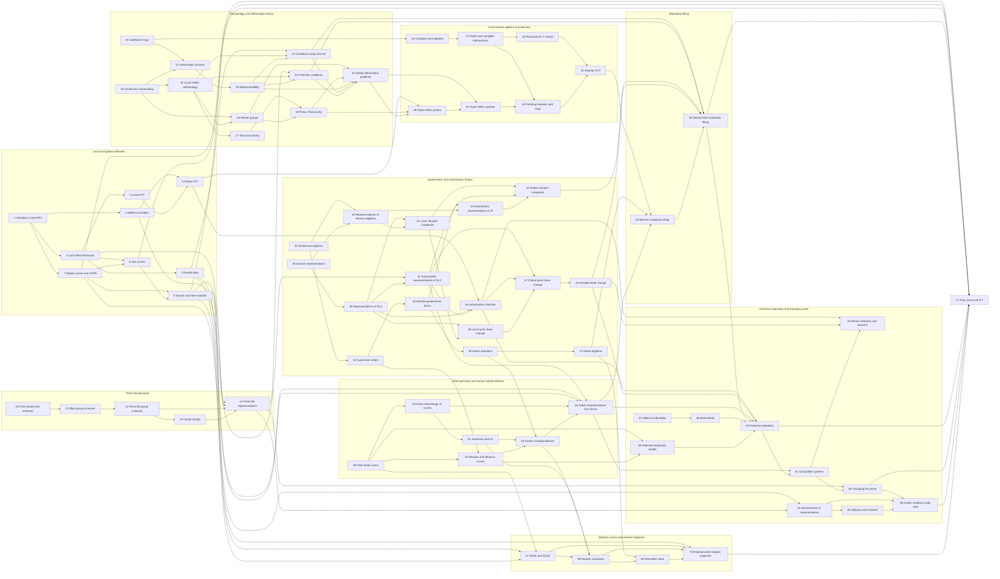

# Rough book dependency graph

An arrow `A --> B` means that book A supplies substantial prerequisites for book B.
This is an architectural sketch rather than a strict reading order: transitive edges and
small shared prerequisites are omitted, and several books could profitably be developed
in parallel.

