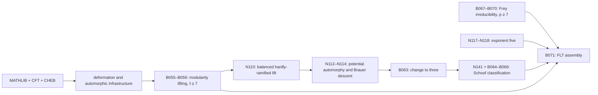

# FLT book dependency graph

This is the dependency companion to `BOOKS.md`. A row `X | A, B` means that A and B supply
substantial direct prerequisites for X. Transitive edges, routine Mathlib facts, and small shared
lemmas are omitted. Topical order in `BOOKS.md` is not a proposed reading order.

The three external reference nodes are:

- `MATHLIB`: the assumed mathematical background visible in the local checkout.
- `CFT`: the companion Class Field Theory development, including reciprocity, Brauer groups, and invariant maps.
- `CHEB`: the companion development of the Chebotarev density theorem.

`CFT` and `CHEB` are proof sources, not permitted axioms. The final no-axiom audit must traverse
all three nodes and reject `sorry`, theorem stubs, or additional mathematical axioms in any
transitive import.

## Critical proof spine

## Direct substantial prerequisites

### I. Local and Global Arithmetic

| Book | Direct prerequisites |
|---|---|
| B001 | MATHLIB |
| B002 | B001 |
| B003 | B002 |
| B004 | MATHLIB |
| B005 | B002, CFT |
| B006 | B004, B005, CFT |
| N081 | MATHLIB |

### II. Algebraic-Geometric Foundations and Descent

| Book | Direct prerequisites |
|---|---|
| N001 | MATHLIB |
| N002 | N001, MATHLIB |
| N003 | B001, N001, N007 |
| N004 | N002, N003 |
| N005 | N002, N003, N004 |
| N007 | N001, MATHLIB |
| N008 | N001, N007, MATHLIB |
| N009 | N001, N010, MATHLIB |
| N010 | MATHLIB |
| N011 | N010, B026 |
| N012 | N001, N009, B020 |

### III. Étale, fppf, and Galois Cohomology

| Book | Direct prerequisites |
|---|---|
| B049 | N007, MATHLIB |
| B050 | N014, N015, N016 |
| N014 | N010, B049, MATHLIB |
| N015 | N009, N014 |
| N016 | N014, N015 |
| N017 | N005, N014, N015, N016 |
| N018 | N014, N015, N016 |
| N019 | N001, B051, N016, N018 |
| N020 | N002, N031, B050 |
| N021 | N007, MATHLIB |
| B015 | MATHLIB |
| B016 | B002, B003, B005, B015, N021 |
| B017 | B016, CFT |
| B018 | B006, B015, B016 |
| B019 | B017, B018, CFT |

### IV. Curves, Abelian Varieties, and Mordell–Weil Theory

| Book | Direct prerequisites |
|---|---|
| N022 | B001, N003, N012 |
| N023 | N022, N025 |
| N024 | N002, N005, N007, N009 |
| B051 | B050, N024, N025 |
| N025 | B010, B012, B013, N007, N009 |
| N026 | N003, N005, N024, N025 |
| N027 | B003, N023, N026 |
| N028 | N004, N005, N026, B051 |
| N029 | N021, N025, B016, B018 |
| N030 | N001, N025, N029 |

### V. Elliptic Curves, Finite-Flat Groups, and Integral p-adic Theory

| Book | Direct prerequisites |
|---|---|
| B010 | N001, N007 |
| B011 | B010 |
| B012 | B010, B011, N007 |
| B013 | B011, B012 |
| B014 | B002, B012, B013, B049 |
| B007 | B001, B002, N003 |
| B008 | B002, B007 |
| B009 | B007, B008, B012 |
| N031 | N002, N009, N010, N025 |
| N032 | N010, MATHLIB |
| N033 | N025, N031, N032 |
| N037 | N021, N032, N033 |
| N038 | B002, B010, B011, B012, B013 |
| N039 | N032, N033, N038 |
| N040 | N031, N032, N033, N039 |
| N041 | B014, N037, N040 |
| N043 | N025, N033, N039, N041 |
| N044 | B003, B014, N038, N041 |

### VI. Deformation Theory and Abstract Taylor–Wiles Patching

| Book | Direct prerequisites |
|---|---|
| B020 | MATHLIB |
| N143 | B015, B020 |
| B021 | B015, B020 |
| B022 | B020, B021, B026 |
| B023 | B003, B016, B021, B022 |
| B024 | B014, B016, B021, B022, N041 |
| B025 | B018, B019, B022, B023, B024 |
| B026 | B020 |
| B027 | B026 |
| B028 | B027 |
| B029 | B019, B025, N142, CHEB |
| B030 | B025, B029 |
| B031 | B027, B030 |
| B032 | B028, B031 |

### VII. Local Representation Theory and Local Transfer

| Book | Direct prerequisites |
|---|---|
| B038 | MATHLIB |
| B039 | N058, N059, N060, N061 |
| N058 | B038 |
| N059 | B002, B038, N058 |
| N060 | B002, B003, B015 |
| N061 | B005, N058, N059, N060 |
| B040 | B033, B038, N063 |
| N063 | B033, B038, N059 |
| B041 | N060, N063, N064 |
| N064 | B039, B040, N060, N063 |
| B046 | B039, B041, N061 |

### VIII. Quaternionic and Global Automorphic Theory

| Book | Direct prerequisites |
|---|---|
| B033 | B001, B002, B006, CFT |
| B034 | B003, B033 |
| B035 | B004, B034 |
| B036 | B034, B035, B038 |
| B037 | B020, B026, B036 |
| B042 | B004, B039, N066, N068, N138 |
| B043 | B035, B040, N066, N068 |
| B044 | B041, B042, B043, N075, N126, N130 |
| B045 | B006, N061, N065, N072 |
| B047 | B042, B046, N078, N127, N139 |
| B048 | B045, B047 |
| N065 | B004, B005 |
| N066 | B038 |
| N067 | MATHLIB |
| N125 | N066, N067 |
| N068 | B004, B038, N066, N067, N125 |
| N069 | N065, N068 |
| N070 | N058, N065, N068 |
| N071 | N060, N070 |
| N138 | B039, N068, N071 |
| N072 | N020, N031, N138 |
| N074 | N067, N068, N069, N125 |
| N075 | N068, N069, N074 |
| N126 | B033, N074 |
| N076 | B039, B040, N060, N066 |
| N130 | N064, N076, N126 |
| N078 | B042, B046 |
| N139 | N069, N075, N078 |
| N127 | B046, N076, N078 |

### IX. Modular and Shimura Geometry with Galois Realization

| Book | Direct prerequisites |
|---|---|
| N045 | B007, B009, N001, N008 |
| N046 | N001, N003, N008, N045 |
| N047 | N003, N004, N005, N046 |
| N048 | N002, N009, N045, N046 |
| B052 | N045, N046, N047, N048, N049, N086, N087, N088, N089, N091, N128, N132 |
| N049 | N024, N026, N028, N047, N048 |
| B053 | B036, B052, N028, N049, N132 |
| N086 | B033, N025 |
| N087 | B001, B006, N025 |
| N140 | B005, B006, N087 |
| N088 | B004, N086, N087, N140 |
| N089 | N007, N008, N011, N025, N086, N088 |
| N132 | N012, N028, N088, N089 |
| N090 | N008, N011, N025, N086, N088, N089 |
| N091 | N009, N012, N015, N025, N089, N090 |
| N128 | N003, N004, N005, N017, N089, N090, N091 |
| N092 | B043, B044, B050, B051, B053, N020, N088, N089, N132 |
| N133 | B043, B044, N018, N019, N020, N090, N091, N128 |
| N093 | B049, B050, N020, N086, N092, N133 |
| B054 | N092, N093, N094, N095, N133, N134 |
| N094 | N017, N027, N060, N091, N128, N093 |
| N095 | N019, N072, N093, N094 |
| N134 | B012, B013, B014, N041, N091, N093, N094 |

### X. Eisenstein Descent, Exceptional Torsion, and the Frey Curve

| Book | Direct prerequisites |
|---|---|
| B067 | N045, N046, N047, N048 |
| B068 | B067, N024, N026, N049, N051, N053, N054 |
| B069 | B037, B068, N050, N051, N052, N053, N054, N055 |
| N050 | B037, N048 |
| N051 | N005, N026, N049, N050 |
| N052 | B012, B013, N021, N051 |
| N053 | B020, N025, N026, N050, N051, N052 |
| N054 | B017, B018, N029, N030, N050, N051, N052, N053 |
| N055 | N002, N009, N048, N049, N053, N054 |
| B070 | B067, B068, B069, N056, N119, N120, N121, N122 |
| N119 | N002, N019, N024, N030, B067 |
| N120 | N019, N119 |
| N121 | N029, N120 |
| N122 | N030, N120, N121 |
| N056 | B006, B007, B008, B009, B014, N038, N055, N122 |
| B071 | B007, B008, B009, B066, B070, N110, N113, N114, N117, N118, CHEB |

### XI. Integral Automorphic Infrastructure and Modularity Lifting

| Book | Direct prerequisites |
|---|---|
| B055 | N135, N101 |
| B056 | B048, B055, N096, N097, N098, N100, N102, N136 |
| N096 | B039, N038, N040, N041 |
| N097 | N005, N026, N028, N128 |
| N098 | B037, B041, B044, N097 |
| N099 | B034, B035, B036, B037, N097 |
| N100 | B024, B025, B037, B054, N094, N096, N098, N143, CHEB |
| N142 | B003, B006, B009, B014, B015 |
| N135 | B025, B037, B053, B054, N011, N096, N100, N142 |
| N101 | B029, B032, N099, N135, N142 |
| N136 | B027, N011, N097, N098, N100, N101 |
| N102 | B055, N096, N097, N098, N100, N136 |

### XII. Arithmetic Approximation and Residual Potential Modularity

| Book | Direct prerequisites |
|---|---|
| B057 | B002, B049 |
| B058 | N001, N007, N012, B057 |
| B059 | N104, N105 |
| B060 | B045, B048, B054, B056, B058, B059, N106 |
| N085 | B002, B057, B058, CHEB |
| N104 | N007, N008, N025, N043, N086, N087 |
| N105 | B002, B007, B008, N038, N041, N104 |
| N106 | B045, B054, B058, N085, N102, N104, N105, N142 |

### XIII. Hardly-Ramified Lifts, Compatible Systems, and Changing Prime

| Book | Direct prerequisites |
|---|---|
| B061 | N095, N114 |
| B062 | N113, N137 |
| B063 | B061, B062, N114, N116 |
| B064 | B003, N044 |
| B065 | N081, B064 |
| B066 | B063, B064, B065, N141 |
| N141 | B002, B003, B005, B006, B012, B013, B014, B049, B064, B065, N021, CFT |
| N108 | B003, B014, B016, B023, B024, N038, N041, N096 |
| N109 | B016, B017, B018, B019, B025, N108 |
| N123 | B017, B019, N021, N109, CFT |
| N110 | B020, B026, B060, N102, N108, N109, N123, N142, N143 |
| N112 | B057, B058, B060, N085, N110 |
| N137 | B045, B047, B048, N112 |
| N113 | B015, B020, N137 |
| N114 | N095, N112, N113, N137 |
| N116 | B003, B014, N041, N094, N114 |

### XIV. The Coefficient-Five Boundary

| Book | Direct prerequisites |
|---|---|
| N117 | B001, MATHLIB |
| N118 | N117 |
